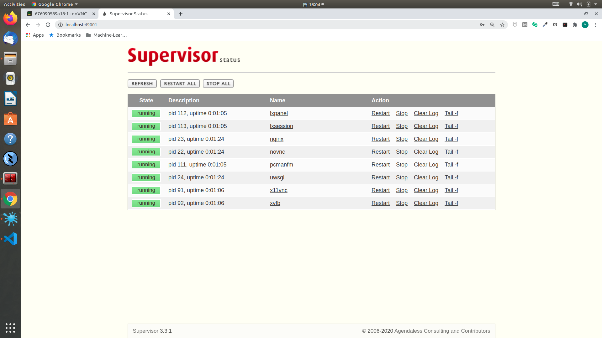
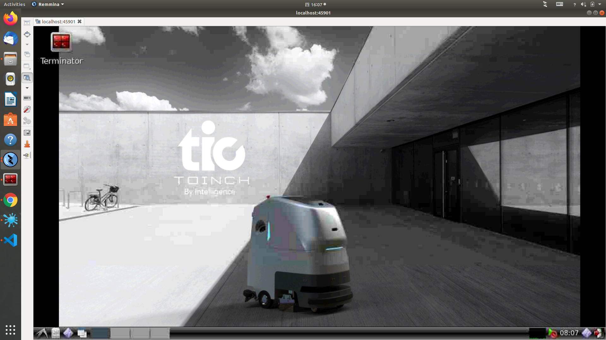
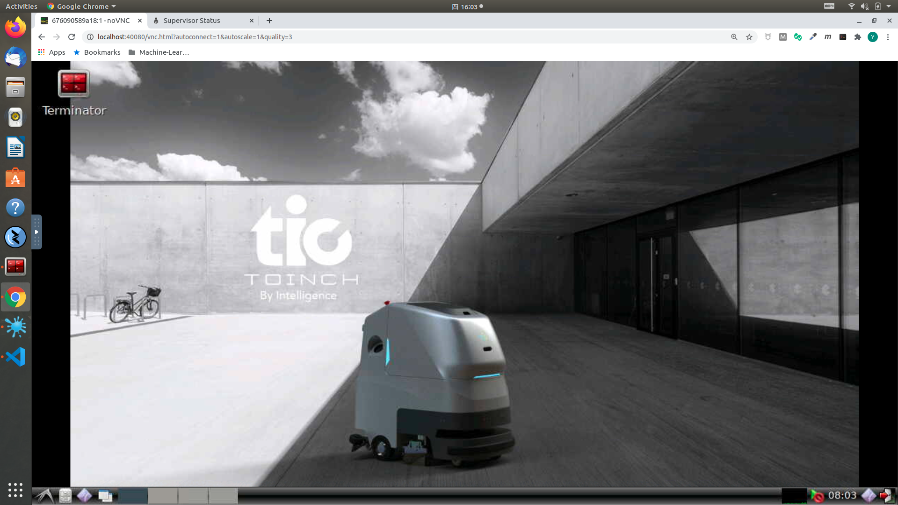

# Docker for Stone Caring Robot

基于Docker的[多传感器融合定位/Sensor Fusion](https://www.shenlanxueyuan.com/my/course/261)学习环境.

---

## 安装配置Docker以及Docker-Compose

在开始使用前，首先需要在本地配置`Docker`以及`Docker-Compose`环境.

---

### 安装Docker

请参考[Docker官方文档](https://docs.docker.com/engine/install/ubuntu/)完成`Docker`环境的安装

安装完成后, 还需要进行`如下操作`, 以保证环境的易用性:

#### 将当前用户加入Docker Group

为了能在非`sudo`模式下使用`Docker`, 需要将当前用户加入`Docker Group`.

* 执行命令:
    
    ```bash
    sudo usermod -aG docker $USER
    ```

* **为了使上述变更生效，请先Logout，再Login**

---

### 安装Docker-Compose

`Docker-Compose`是基于Docker解决方案的Orchestrator. 

请参考[Docker Compose官方文档](https://docs.docker.com/compose/install/)完成`Docker-Compose`环境的安装

---

## 编译镜像

在Repo根目录下，执行如下操作，编译镜像. 镜像的内容有依赖，编译需要按顺序执行:

---

## 获取镜像

在安装完成`Docker`以及`Docker-Compose`之后，需要从`阿里云`源上获得所需镜像.

```bash
```

---

## Use Case Overview

Below are the tutorials for possible use cases:

* [Function Development](https://gitee.com/shanghai_toinch_intelligence/stone_caring_robot_docker#use-case-03----for-function-development)

---

## Use Case 03 -- For Function Development

[Back to Overview](https://gitee.com/shanghai_toinch_intelligence/stone_caring_robot_docker#use-case-overview)

---

### 配置docker-compose

此处使用`Docker-Compose`进行环境的配置与管理. 在开始配置前, 请将:

* Repo [stone_caring_robot](https://gitee.com/shanghai_toinch_intelligence/stone_caring_robot)下载到本地, 同步每个`submodule`至`master`或`当前Function Development`分支, **同时记录repo的本地路径(后续Volume Mounting配置需要)**

* **明确各种数据(ROS bag以及其他数据)的本地路径(后续Volume Mounting配置需要)**

---

#### Volume Mounting

在[**docker-compose.yml**](docker-compose.yml)中的如下字段, 可配置Docker Instance到本地Volumn的文件系统映射:

* `stone_caring_robot的本地路径`. 启动后，该本地路径会被映射到Docker FS的`/workspace/stone_caring_robot`
* `data的本地路径`. 启动后，该本地路径会被映射到Docker FS的`/workspace/data`
* 需要的其他路径. docker-compose的映射规则为`[LOCAL_PATH]`:`[DOCKER_FS_PATH]`

```yaml
    volumes:
      # mount your workspace here:
      - [YOUR_LOCAL_REPO_PATH]:/workspace/stone_caring_robot
      # mount ros bags and other data here:
      - [YOUR_LOCAL_DATA_PATH]:/workspace/data
      # if needed you can mount other local volumes here:
```

---

#### Network Port Mapping

当前系统Exposed Ports如下. 按照功能, 开放的端口可以分为如下4类:

* `system service` `VNC`以及`supervisord`的系统服务端口
    * `5901`: x11vnc
    * `80`: HTML5 VNC
    * `9001`: supervisord admin portal
* `ROS`
    * `11311`: ROS master
* `TIC API Gateway`:
    * `9993`: TIC API gateway

在Dockerfile中的定义汇总如下:

```Dockerfile
# for VNCs
EXPOSE 80 5901
# for web portal:
EXPOSE 9001
# for ROS:
EXPOSE 11311
# for API gateway:
EXPOSE 9990-9999
```

在[**docker-compose.yml**](docker-compose.yml)中的如下字段, 可配置Docker Instance到本地Ports的网络映射: 

```yaml
    ports:
      # HTML5 VNC:
      - [YOUR_LOCAL_HTML5_VNC_PORT]:80
      # standard VNC client:
      - [YOUR_LOCAL_VNC_CLIENT_PORT]:5901
      # supervisord admin:
      - [YOUR_LOCAL_SUPERVISORD_ADMIN_PORT]:9001
      # ROS master:
      - [YOUR_LOCAL_ROS_MASTER_ACCESS_PORT]:11311
      # API gateway:
      - [YOUR_LOCAL_API_GATEWAY_PORT]:9993
```

---

### Up and Running 

#### Launch VNC Instance

```bash
# using docker-compose
docker-compose up  workspace-vnc-bionic-cpu
```

---

#### Health Check

Access supervisord monitor to make sure all processes have been started (default password `ticrobotics`): http://[HOST_IP]:49001



---

#### VNC Access:

You can access the desktop with standard VNC client (default password `ticrobotics`)

##### VNC Client

On the system you can use 

* Remmina on Ubuntu
* TightVNC Viewer on Windows

to create a VNC session to connect to: http://[HOST_IP]:45901



##### HTML5 VNC

Or interact with the environment directly inside your browser (Google Chrome is recommended)

1. Open Google Chrome and go to http://[HOST_IP]:40080
2. For the first connection the internal desktop service will be restarted to adjust to your current view portal size. **Just be patient**

After **view portal initialization** you will have the following environment available in your browser



---

### Build

#### Function 

使用下列命令，编译TIC解决方案:

```bash
# go to repo home/tic:
cd /workspace/stone_caring_robot
# clean up, config then compile:
catkin clean -y && catkin config --install && catkin build
```

#### Release Instance

Here `multi-stage` build is used to prevent source code & token leakage.

```bash
docker-compose build --build-arg SSH_PRIVATE_KEY="$(cat ~/.ssh/[YOUR_CI_SSH_KEY])" [YOUR_RELEASE_INSTANCE]
```

---

### Development

开发环境的设计理念如下:


