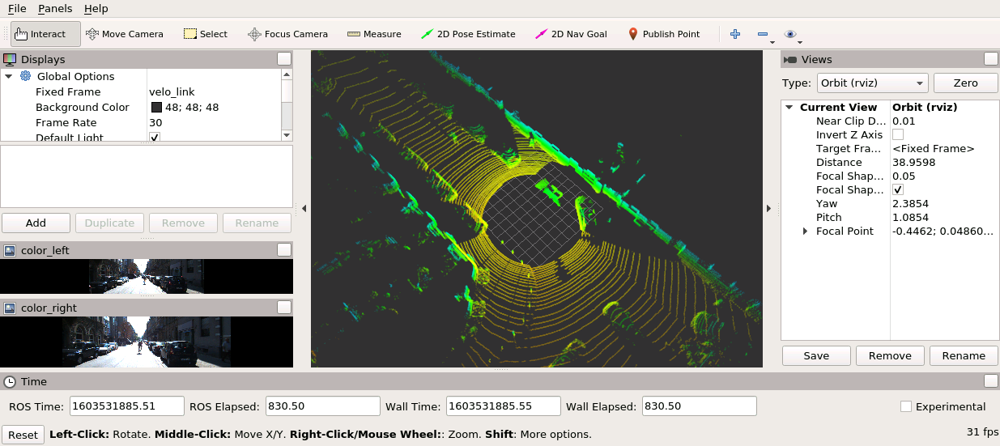
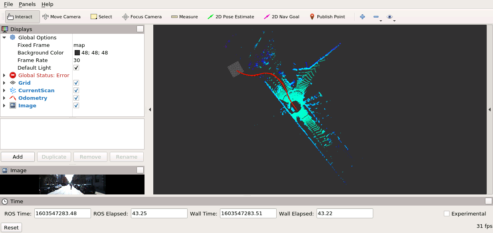
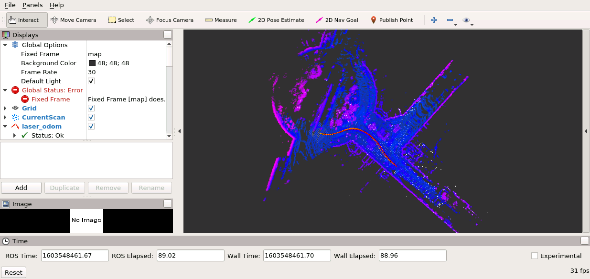
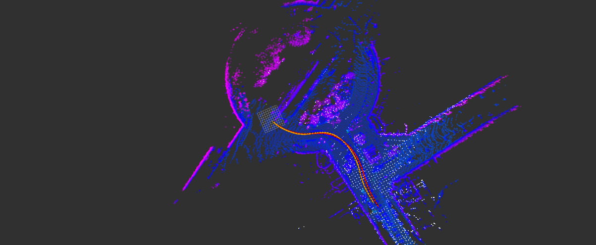
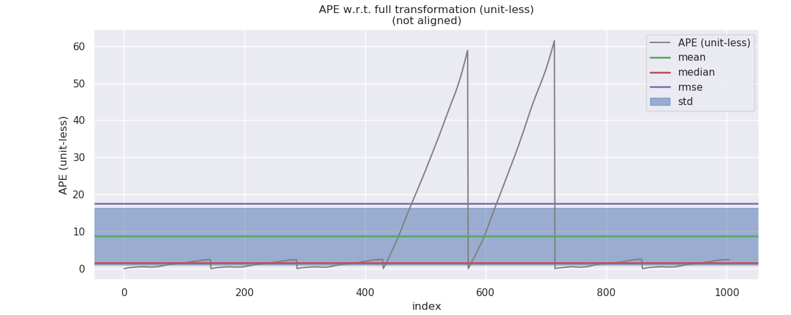
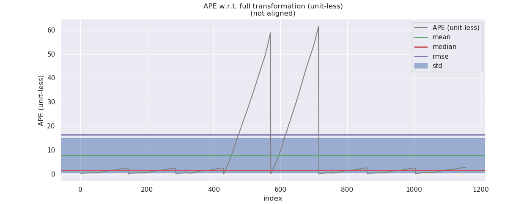
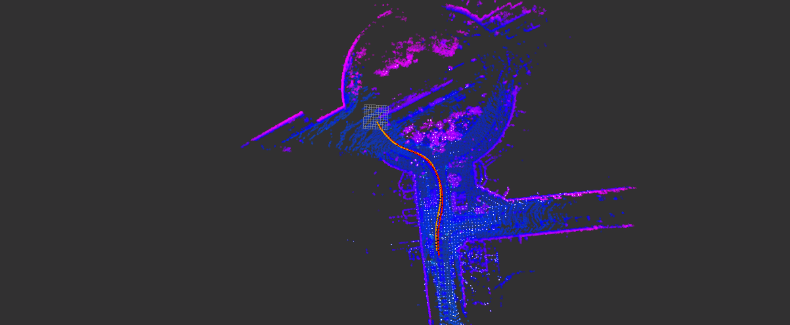

# Sensor Fusion: Lidar Odometry -- 多传感器融合定位: 激光里程计

This is the solution of Assignment 01 of Sensor Fusion from [深蓝学院](https://www.shenlanxueyuan.com/course/261).

深蓝学院从多传感器融合定位第1节Lidar Odometry答案. 版权归深蓝学院所有. 请勿抄袭.

**WARNING** ONLY Reproducible using Corresponding Docker Environment. Not Responsible for Custom Env. Adaptation.

---

## Problem Statement

---

### 1. 了解 KITTI 数据集,完成相关依赖库的安装,运行作业代码,提供程序运行成功的截图

Docker运行环境参见[here](https://github.com/AlexGeControl/Sensor-Fusion)

所选的KITTI Test Drive数据为`2011_09_26_drive_0005_sync`, 转换得到的ROS Bag回放时的RViz截图如下所示:







---

### 2. 在作业代码中, 仿照写好的基于`NDT`的匹配, 重新建立一个基于`ICP`的里程计(可以使用`PCL`), 要求可在配置文件中切换两种方法. 之后使用`evo`评估两种算法得到的轨迹精度

`ICP`的估计结果如下所示:



使用`ICP`时的参数配置如下:

```yaml
data_path: /workspace/assignments/01-lidar-odometry/output   # 数据存放路径

# 匹配
registration_method: ICP   # 选择点云匹配方法，目前支持：ICP, NDT

# 局部地图
key_frame_distance: 2.0 # 关键帧距离
local_frame_num: 20
local_map_filter: voxel_filter # 选择滑窗地图点云滤波方法，目前支持：voxel_filter

# rviz显示
display_filter: voxel_filter # rviz 实时显示点云时滤波方法，目前支持：voxel_filter

# 当前帧
frame_filter: voxel_filter # 选择当前帧点云滤波方法，目前支持：voxel_filter

# 各配置选项对应参数
## 匹配相关参数
ICP:
    max_corr_dist : 1.2
    trans_eps : 0.01
    euc_fitness_eps : 0.36
    max_iter : 30
NDT:
    res : 1.0
    step_size : 0.1
    trans_eps : 0.01
    max_iter : 30
## 滤波相关参数
voxel_filter:
    local_map:
        leaf_size: [0.6, 0.6, 0.6]
    frame:
        leaf_size: [1.3, 1.3, 1.3]
    display:
        leaf_size: [0.5, 0.5, 0.5]
```

`ICP Registration`的实现参考[here](https://github.com/AlexGeControl/Sensor-Fusion/blob/cfede769eb48e7785e3a99fd1c61ff0bec0b1b68/workspace/assignments/01-lidar-odometry/src/lidar_localization/src/models/registration/icp_registration.cpp#L1)

两者的KPI比较参照下表. 在`2011_09_26_drive_0005_sync`上, 两者的估计性能相近, `ICP`方法略优.

NDT                |ICP
:-------------------------:|:-------------------------:
  |  

|  Reg.  |      NDT      |      ICP      |
|:------:|:-------------:|:-------------:|
|   max  |   61.497112   |   61.497112   |
|  mean  |    8.725985   |    7.750354   |
| median |    1.519101   |    1.506272   |
|   min  |    0.000001   |    0.000001   |
|  rmse  |   17.573251   |   16.387662   |
|   sse  | 310363.256050 | 310718.670113 |
|   std  |   15.253732   |   14.439096   |

---

### 3. 自己实现一个激光匹配的方法, 可以是`ICP`, `NDT`或者是`LOAM`. 新建一个接口类的实例,同样要求可在配置文件中对各方法进行切换. 最后和作业2中所用的开源的`ICP`, `NDT`进行精度比较.

我实现了基于`SVD`的`Iterative ICP`. 该实现支持`PCL ICP`的全部参数.

`ICP SVD`的估计结果如下所示:



使用`ICP SVD`时的参数配置如下:

```yaml
data_path: /workspace/assignments/01-lidar-odometry/output   # 数据存放路径

# 匹配
registration_method: ICP_SVD   # 选择点云匹配方法，目前支持：ICP, NDT, ICP_SVD

# 局部地图
key_frame_distance: 2.0 # 关键帧距离
local_frame_num: 20
local_map_filter: voxel_filter # 选择滑窗地图点云滤波方法，目前支持：voxel_filter

# rviz显示
display_filter: voxel_filter # rviz 实时显示点云时滤波方法，目前支持：voxel_filter

# 当前帧
frame_filter: voxel_filter # 选择当前帧点云滤波方法，目前支持：voxel_filter

# 各配置选项对应参数
## 匹配相关参数
ICP:
    max_corr_dist : 1.2
    trans_eps : 0.01
    euc_fitness_eps : 0.36
    max_iter : 30
NDT:
    res : 1.0
    step_size : 0.1
    trans_eps : 0.01
    max_iter : 30
ICP_SVD:
    max_corr_dist : 1.2
    trans_eps : 0.01
    euc_fitness_eps : 0.36
    max_iter : 10
## 滤波相关参数
voxel_filter:
    local_map:
        leaf_size: [0.6, 0.6, 0.6]
    frame:
        leaf_size: [1.3, 1.3, 1.3]
    display:
        leaf_size: [0.5, 0.5, 0.5]
```

`ICP SVD`的实现参考[here](https://github.com/AlexGeControl/Sensor-Fusion/blob/9c241253fbfa132000f7c11ef612526aebe70490/workspace/assignments/01-lidar-odometry/src/lidar_localization/src/models/registration/icp_svd_registration.cpp#L70)

与PCL实现的KPI比较参照下表. 在`2011_09_26_drive_0005_sync`上, 自行实现的`ICP SVD`的精度比PCL的实现更优.

|  Reg.  |      NDT      |      ICP      |    ICP SVD    |
|:------:|:-------------:|:-------------:|:-------------:|
|   max  |   61.497112   |   61.497112   |   61.497112   |
|  mean  |    8.725985   |    7.750354   |    6.131557   |
| median |    1.519101   |    1.506272   |    1.371925   |
|   min  |    0.000001   |    0.000001   |    0.000001   |
|  rmse  |   17.573251   |   16.387662   |   14.296924   |
|   sse  | 310363.256050 | 310718.670113 | 311304.317832 |
|   std  |   15.253732   |   14.439096   |   12.915342   |