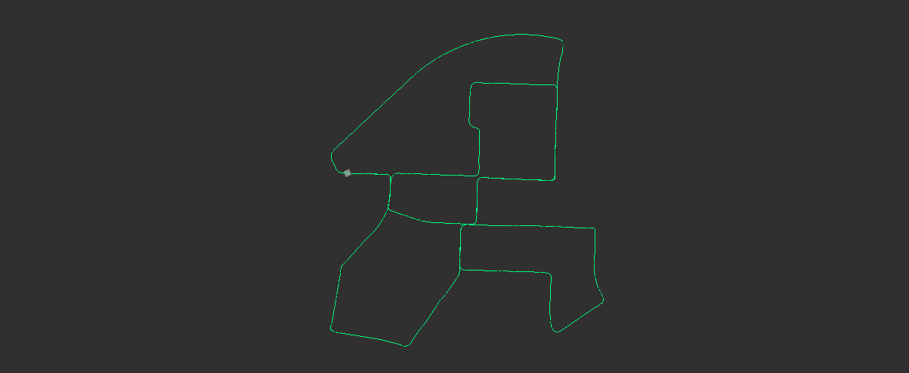
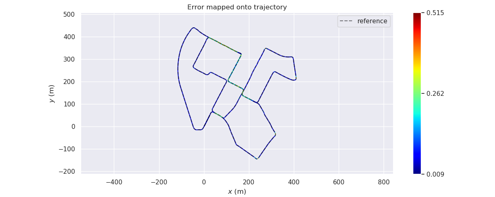
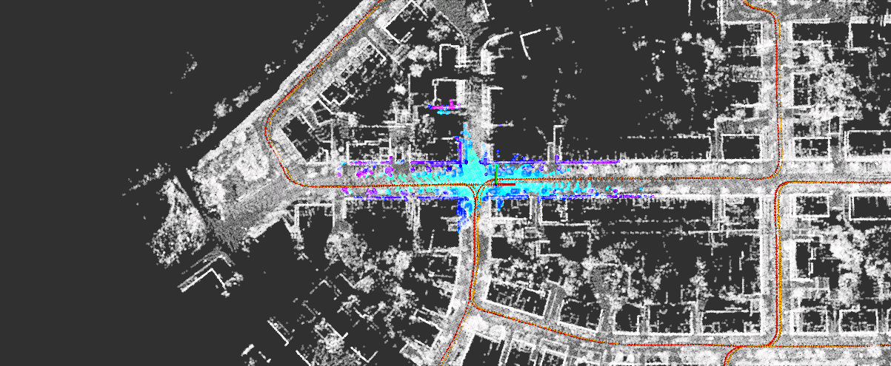

# Sensor Fusion: Lidar Mapping -- 多传感器融合定位: 基于地图的定位

This is the solution of Assignment 02 of Sensor Fusion from [深蓝学院](https://www.shenlanxueyuan.com/course/261).

深蓝学院从多传感器融合定位第2节Lidar Mapping答案. 版权归深蓝学院所有. 请勿抄袭.

---

## Problem Statement

---

### 1. 闭环修正及精度评价

提供的工程框架中, 已经给出了闭环的流程和实现, 但是是基于ICP的, 这是在已知粗略位姿情况下的实现方式. 在未知粗略位姿情况下, 闭环检测的实现难度会加大. 要求使用前面讲过的`Scan Context`, 实现此功能, 并和已有的图优化功能完成对接, 实现`Loop Closure`修正. 并最终给出修正前后的轨迹精度对比.

#### ANS

基于`Scan Context`的`Loop Closure Detection`核心逻辑如下. 此处使用`Scan Context`产生所需的`Loop Closure Proposal`, `GNSS/IMU`提供的粗略位姿估计仅用于检查Scan Context提供回环中关键帧的距离.

```c++
    // only perform loop closure detection for every skip_num key frames:
    if (++skip_cnt < skip_num)
        return false;

    // generate loop-closure proposal using scan context match:
    std::pair<int, float> proposal = scan_context_manager_ptr_->DetectLoopClosure();
    const int proposed_key_frame_id = proposal.first;
    const float proposed_yaw_change = proposal.second;

    // check proposal validity:
    if (ScanContextManager::NONE == proposed_key_frame_id) {
        return false;
    }

    // check RTK position difference:
    const KeyFrame &current_key_frame = all_key_gnss_.back();
    const KeyFrame &proposed_key_frame = all_key_gnss_.at(proposed_key_frame_id);

    Eigen::Vector3f translation = (
        current_key_frame.pose.block<3, 1>(0, 3) - proposed_key_frame.pose.block<3, 1>(0, 3)
    );
    float key_frame_distance = translation.norm();

    // update detection interval:
    skip_cnt = 0;
    skip_num = static_cast<int>(key_frame_distance);
    if (key_frame_distance > detect_area_) {
        skip_num = std::max((int)(key_frame_distance / 2.0), loop_step_);
        return false;
    } else {
        key_frame_index = proposed_key_frame_id;
        yaw_change_in_rad = proposed_yaw_change;

        skip_num = loop_step_;
        return true;
    }
```

核心功能的实现, 请点击下述链接:

* [Scan Context for Loop Closure Detection](https://github.com/AlexGeControl/Sensor-Fusion/blob/e241add57755c6b229077cadfc23259f51982b63/workspace/assignments/02-lidar-mapping/src/lidar_localization/src/mapping/loop_closing/loop_closing.cpp#L139)

* [Scan Context Manager Implementation](https://github.com/AlexGeControl/Sensor-Fusion/blob/e241add57755c6b229077cadfc23259f51982b63/workspace/assignments/02-lidar-mapping/src/lidar_localization/src/models/scan_context_manager/scan_context_manager.cpp#L656)

`Scan Context Loop Closure`修正后的轨迹估计如下图所示:



使用`Scan Context`修正前后, 轨迹估计误差的对比如下所示:

GNSS/IMU Proposal          |Scan Context Proposal
:-------------------------:|:-------------------------:
  |  

|  Prop. |    GNSS/IMU   |  Scan Context |
|:------:|:-------------:|:-------------:|
|   max  |    0.584266   |    0.514676   |
|  mean  |    0.105530   |    0.095825   |
| median |    0.056007   |    0.050754   |
|   min  |    0.009975   |    0.008929   |
|  rmse  |    0.145464   |    0.133023   |
|   sse  |   40.499873   |   33.620606   |
|   std  |    0.100116   |    0.092264   |

由上述结果可知, `Scan Context`的使用, `可以显著提升轨迹估计精度`.

---

### 2. 位姿初始化

提供的工程框架中, 已经给出了位姿初始化功能, 但是是在起始位置的, 并且是基于已知粗略位姿的. 要求实现`地图中任意位置的位姿初始化`, 可以从三种难度等级中任选一种, 难度越高, 得分越高.

#### ANS

我选择`位置和姿态均未知的定位初始化`. 算法核心逻辑如下:

1. 在`建图`阶段, 将`Scan Context`的索引以及数据(包括`Key Frame`及其`Scan Context` & `Ring Key`), 写入持久性存储. 代码实现参考[Scan Context IO Using Protobuf -- Save](https://github.com/AlexGeControl/Sensor-Fusion/blob/4d3da9b45b9c620035571cb7b752eaedb371a613/workspace/assignments/02-lidar-mapping/src/lidar_localization/src/models/scan_context_manager/scan_context_manager.cpp#L150).
2. 在`定位`阶段, 首先将`建图`阶段构建的`Scan Context`从持久性存储加载回内存. 代码实现参考代码实现参考[Scan Context IO Using Protobuf -- Load](https://github.com/AlexGeControl/Sensor-Fusion/blob/4d3da9b45b9c620035571cb7b752eaedb371a613/workspace/assignments/02-lidar-mapping/src/lidar_localization/src/models/scan_context_manager/scan_context_manager.cpp#L231).
3. 针对`无强对称性`的环境, 譬如`KITTI Test Drive Playback`, 可直接使用`初始Velodyne Scan`, 查询`Scan Context`索引, 完成定位初始化. 在参数合适的情况下, 该方案位置估计精度与`GNSS/IMU初始化`相近, 同时还可以提供`航向偏差估计`.
4. 针对`强对称性`的环境, 譬如`大型室内场所`, 可将`Scan Context`查询得到的, 相似度足够高的`Init Pose Candidate`, 全部加入`Particle Filter`(如AMCL 3D), 通过后续观测, 筛选出真正的位姿.
5. 在无高质量GNSS/IMU观测, 且单纯依赖激光无法解决初始化的情况下, 可以进一步加入`视觉特征`, 或者使用其他定位手段(譬如UWB室内定位), 解决初始化问题.

为了检验上述方案的可靠性, 将定位初始化的核心逻辑修改如下:

```c++
bool MatchingFlow::UpdateMatching() {
    if (!matching_ptr_->HasInited()) {
        // first try to init using scan context query:
        if (
            matching_ptr_->SetScanContextPose(current_cloud_data_)
        ) {
            Eigen::Matrix4f init_pose = matching_ptr_->GetInitPose();

            // evaluate deviation from GNSS/IMU:
            float deviation = (
                init_pose.block<3, 1>(0, 3) - current_gnss_data_.pose.block<3, 1>(0, 3)
            ).norm();

            // prompt:
            LOG(INFO) << "Scan Context Localization Init Succeeded. Deviation between GNSS/IMU: " 
                      << deviation
                      << std::endl;
        } 
        // if failed, fall back to GNSS/IMU init:
        else {
            matching_ptr_->SetGNSSPose(current_gnss_data_.pose);

            LOG(INFO) << "Scan Context Localization Init Failed. Fallback to GNSS/IMU." 
                      << std::endl;
        }
    }

    return matching_ptr_->Update(current_cloud_data_, laser_odometry_);
}
```

`Localization Init Using Scan Context`的实时轨迹估计如下图所示. 在Playback的整个过程中, `Scan Context Init` & `NDT Lidar Odometry`的估计轨迹与`GNSS/IMU`的观测轨迹有很高的重合度, 证明了`Scan Context Init`的可行性.



