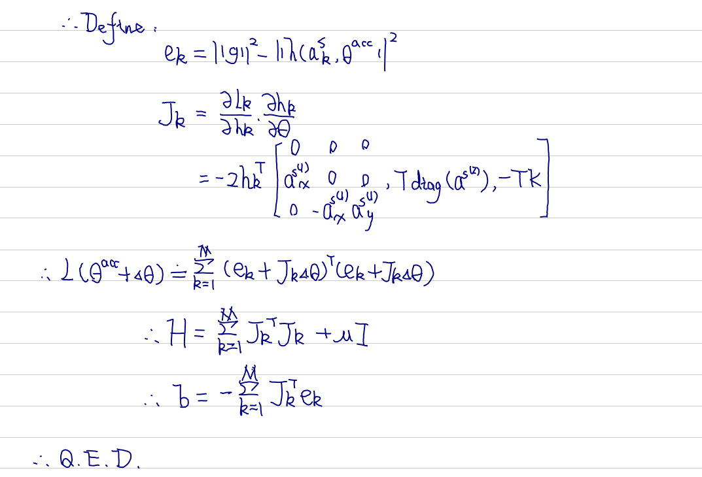
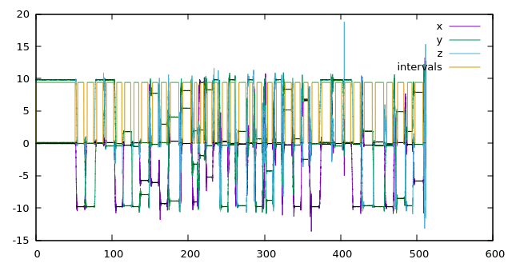
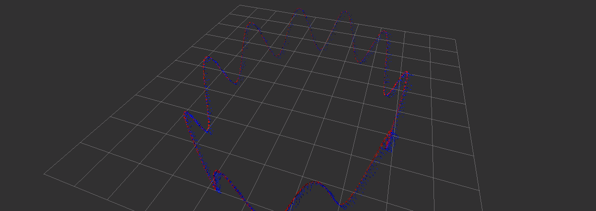
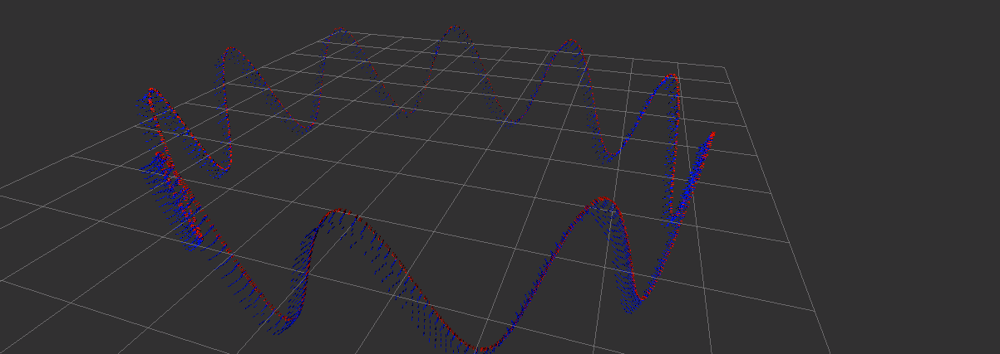
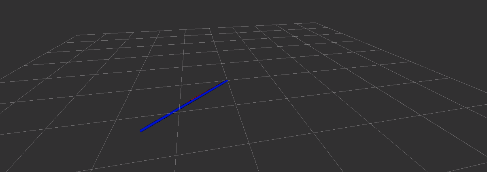
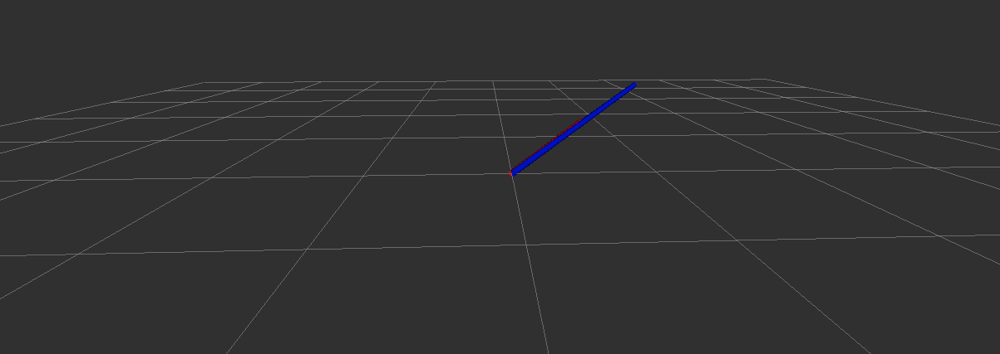

# Sensor Fusion: Inertial Measurement Unit -- 多传感器融合定位: 惯性导航器件

This is the solution of Assignment 03 of Sensor Fusion from [深蓝学院](https://www.shenlanxueyuan.com/course/261).

深蓝学院多传感器融合定位第3节Inertial Measurement Unit答案. 版权归深蓝学院所有. 请勿抄袭.

---

## Problem Statement

---

### 1. Simulate IMU Measurement and Perform Allan Variance Analysis on Simulated Data
### 1. 仿真IMU数据, 并进行Allan方差分析

#### ANS

首先, 使用`gnss-ins-sim ROS wrapper package`, 产生`Allan Variance analysis`所需的`ROS Bag`:

```bash
# build
catkin config --install && catkin build gnss_ins_sim
# run:
source install/setup.bash
roslaunch gnss_ins_sim gnss_ins_sim_recorder.launch
```

若使用默认配置, 可在Docker环境`/workspace/data/gnss_ins_sim`路径下发现生成的`ROS Bag`.

接着, 使用`imu_calibration`包, 进行`Allan Variance analysis`:

```bash
# build
catkin config --install && catkin build imu_calibration
# run:
source install/setup.bash
roslaunch imu_calibration imu_calibration.launch
```

若使用默认配置, 可在Docker环境`/workspace/data/gnss_ins_sim`路径下发现生成的`imu_calibration_results`

#### Results 

对`gnss-ins-sim`中的`low-accuracy`模型, `Allan Variance analysis`得到的`ARW/VRW(参数N)`估计结果与真值的对比如下. 结果显示`标定算法能够有效估计IMU的噪声参数`:

| ARW/VRW | Ground Truth | Allan Variance Estimation |
|:-------:|:------------:|:-------------------------:|
|  gyro_x | 2.181662e-04 |        2.174482e-04       |
|  gyro_y | 2.181662e-04 |        2.190593e-04       |
|  gyro_z | 2.181662e-04 |        2.209243e-04       |
| accel_x | 8.333333e-04 |        8.226509e-04       |
| accel_y | 8.333333e-04 |        8.454541e-04       |
| accel_z | 8.333333e-04 |        8.345325e-04       |

所获得的`Allan Variance curves`如下图所示:

Allan Variance Curve, Gyro |Allan Variance Curve, Accel
:-------------------------:|:-------------------------:
  |  

--- 

### 2. 设计一种转台旋转方案, 并基于仿真数据, 进行内参求解的验证

#### ANS

`转台旋转方案`设计如下. 方案包含`两个阶段`:

* `第一阶段--陀螺仪刻度系数K与安装误差S求解` 
    * 使转台分别沿`IMU`系`+-X`, `+-Y`, `+-Z`三个轴正反方向做角速度幅值, 时间相同的定轴旋转, 标定`陀螺仪`的`刻度系数`与`安装误差`.
* `第二阶段--陀螺仪零偏误差Epsilon求解, 以及加速度计刻度系数K, 安装误差S以及零偏误差Epsilon的求解`
    * 使转台分别绕`IMU`系`Yaw`, `Pitch`, `Roll`三个轴旋转`+-90`度, 然后静止一段时间, 标定`陀螺仪`的`零偏误差`, 以及`加速度计`的`刻度系数`， `安装误差`以及`零偏误差`.

上述方案对应的`gnss-ins-sim`定义参见[here](src/gnss_ins_sim/config/motion_def/deterministic_error_calib_gyro.csv)

对应算法的`Python`实现参见[here](src/imu_calibration/scripts/estimate_deterministic_error.py#L125)

标定结果的真值与估计值对比如下. 结果显示`标定算法能够有效估计IMU的确定性误差参数`:

* Ground Truth:

    ```python
    # GNSS/INS sim config:
    imu_err = {
        # 1. gyro:
        # a. random noise:
        # gyro angle random walk, deg/rt-hr
        'gyro_arw': np.array([0.00, 0.00, 0.00]),
        # gyro bias instability, deg/hr
        'gyro_b_stability': np.array([0.0, 0.0, 0.0]),
        # gyro bias isntability correlation time, sec
        # 'gyro_b_corr': np.array([100.0, 100.0, 100.0]),
        # b. deterministic error:
        'gyro_b': np.array([36.00, 36.00, 36.00]),
        'gyro_k': np.array([0.98, 0.98, 0.98]),
        'gyro_s': np.array([0.01, 0.01, 0.01, 0.01, 0.01, 0.01]),
        # 2. accel:
        # a. random noise:
        # accel velocity random walk, m/s/rt-hr
        'accel_vrw': np.array([0.05, 0.05, 0.05]),
        # accel bias instability, m/s2
        'accel_b_stability': np.array([2.0e-4, 2.0e-4, 2.0e-4]),
        # accel bias isntability correlation time, sec
        'accel_b_corr': np.array([100.0, 100.0, 100.0]),
        # b. deterministic error:
        'accel_b': np.array([0.01, 0.01, 0.01]),
        'accel_k': np.array([0.98, 0.98, 0.98]),
        'accel_s': np.array([0.01, 0.01, 0.01, 0.01, 0.01, 0.01]),
        # 3. mag:
        'mag_si': np.eye(3) + np.random.randn(3, 3)*0.0, 
        'mag_hi': np.array([10.0, 10.0, 10.0])*0.0,
        'mag_std': np.array([0.1, 0.1, 0.1])
    }
    ```

    ```json
    {
        "gyro": {
            "scale": [
                0.980, 0.010, 0.010, 
                0.010, 0.980, 0.010, 
                0.010, 0.010, 0.980
            ], 
            "bias": {
                "x": 36.000,
                "y": 36.000, 
                "z": 36.000
            }
        },
        "accel": {
            "scale": [
                0.980, 0.010, 0.010, 
                0.010, 0.980, 0.010, 
                0.010, 0.010, 0.980
            ], 
            "bias": {
                "x": 0.010,
                "y": 0.010, 
                "z": 0.010
            }
        }
    }
    ```

* Estimated Result(For raw output click [here](doc/02-separated-calibration-results.json)):

    ```json
    {
        "gyro": {
            "scale": [
                0.980, 0.010, 0.010, 
                0.010, 0.980, 0.010, 
                0.010, 0.010, 0.980
            ], 
            "bias": {
                "y": 35.999, 
                "x": 35.999, 
                "z": 35.999
            }
        }, 
        "accel": {
            "scale": [
                0.980, 0.010, 0.010, 
                0.010, 0.980, 0.010, 
                0.010, 0.010, 0.980
            ], 
            "bias": {
                "y": 0.010, 
                "x": 0.010, 
                "z": 0.010
            }
        }
    }
    ```

---

### 3. 推导基于Levenberg-Marquardt方法, 进行加速度计和陀螺仪内参估计的优化过程. 按照课程中讲述的模型, 修改参考代码, 使用仿真数据, 验证标定算法的正确性

#### ANS

针对`加速度计标定`的`Levenberg-Marquardt`方法推导的Overview如下. 详细过程参考[here](doc/03-imu-tk-lm-derivation.pdf):



使用课程中讲述的模型, 需要将代码修改如下:

1. 修改`Ceres Params` [here](src/imu_tk/src/calibration.cpp#L215)

    ```c++
    acc_calib_params[0] = init_acc_calib_.misXZ();
    acc_calib_params[1] = init_acc_calib_.misXY();
    acc_calib_params[2] = init_acc_calib_.misYX();
    ```

2. 修改`Ceres Accel Residual` [here](src/imu_tk/src/calibration.cpp#L83)

    ```c++
    CalibratedTriad_<_T2> calib_triad( 
      // mis_yz, mis_zy, mis_zx:
      _T2(0), _T2(0), _T2(0),
      // mis_xz, mis_xy, mis_yx:
      params[0], params[1], params[2],
      //    s_x,    s_y,    s_z:
      params[3], params[4], params[5], 
      //    b_x,    b_y,    b_z: 
      params[6], params[7], params[8] 
    );
    ```

3. 修改`Optimal Params Loader` [here](src/imu_tk/src/calibration.cpp#L284)

    ```c++
    acc_calib_ = CalibratedTriad_<_T>( 
        0,0,0,
        min_cost_calib_params[0],
        min_cost_calib_params[1],
        min_cost_calib_params[2],
        min_cost_calib_params[3],
        min_cost_calib_params[4],
        min_cost_calib_params[5],
        min_cost_calib_params[6],
        min_cost_calib_params[7],
        min_cost_calib_params[8] 
    );
    ```

标定完成后, `Accel Misalignment Matrix`如下:

```bash
          1          -0           0
-0.00354989           1          -0
-0.00890444  -0.0213032           1
```

测量值时间序列可视化结果如下:



---

### 4. 对一组数据进行惯性导航解算验证, 要求:

* 数据可以使用仿真数据,也可以使用KITTI数据集中的数据, 只不过使用KITTI数据时, 要修改kitti2bag的代码,把`IMU`的输出频率恢复成`100Hz`,它的原版程序在生成bag时对数据做了降频.

* 由于MEMS惯导误差发散快, 导航时间不用太长, 几分钟即可. 如果想验证高精度惯导随时间发散的现象, 可用仿真数据生成.

* 解算时尽量对比验证`角增量方法`和`旋转矢量方法`的区别. 由于定轴转动下, 二者没有区别, 因此若要验证该现象, 数据要运动剧烈些.

#### ANS

为了方便自定义运动, 以实现更加剧烈的运动, 本问使用`C++ IMU Simulator`. 编译`imu_integration` [here](src/imu_integration/README.md)

```bash
# build:
catkin clean -y && catkin config --install && catkin build imu_integration
# set up session:
source install/setup.bash
# launch:
roslaunch imu_integration imu_integration.launch
```

`角增量方法`的实现如下 [here](src/imu_integration/src/estimator/activity.cpp#L126):

```c++
    // get deltas:
    Eigen::Vector3d angular_delta; 

    GetAngularDelta(1, 0, angular_delta);

    // update orientation:
    Eigen::Matrix3d R_curr, R_prev;
    UpdateOrientation(angular_delta, R_curr, R_prev);

    // get velocity delta:
    double delta_t;
    Eigen::Vector3d velocity_delta;
    GetVelocityDelta(1, 0, R_curr, R_prev, delta_t, velocity_delta);

    // update position:
    UpdatePosition(delta_t, velocity_delta);

    // move forward:
    imu_data_buff_.pop_front();
```

`等效旋转矢量方法(对角速度变化做1阶假设)`的实现如下 [here](src/imu_integration/src/estimator/activity.cpp#L146):

```c++
        // get angular deltas:
    Eigen::Vector3d angular_delta_1, angular_delta_2;
    GetAngularDelta(1, 0, angular_delta_1);
    GetAngularDelta(2, 1, angular_delta_2);

    // get effective rotation:
    Eigen::Vector3d angular_delta = angular_delta_1 + angular_delta_2 + 2.0/3.0*angular_delta_1.cross(angular_delta_2);

    // update orientation:
    Eigen::Matrix3d R_curr, R_prev;
    UpdateOrientation(angular_delta, R_curr, R_prev);

    // get velocity delta:
    double delta_t;
    Eigen::Vector3d velocity_delta;
    GetVelocityDelta(2, 0, R_curr, R_prev, delta_t, velocity_delta);

    // update position:
    UpdatePosition(delta_t, velocity_delta);

    // move forward:
    imu_data_buff_.pop_front();
    imu_data_buff_.pop_front();
```

在无噪声的情况下, 使用`角增量方法`与`等效旋转矢量方法`, 运行`3分钟`后估计航迹与真实航迹的对比如下图. 其中红色为`Ground Truth`, 蓝色为`Estimation`.

Zero Order                 |First Order
:-------------------------:|:-------------------------:
  |  

上述对比显示, `等效旋转矢量方法`, 在位置估计上, 精度较差, 原因在于其对位置/速度进行更新时, 步长过大.

仅考虑航向跟踪时, 两种方法的对比如下图.

Zero Order                 |First Order
:-------------------------:|:-------------------------:
  |  

上述对比显示, `角增量方法`与`等效旋转矢量方法`, 针对选择的运动, 在航向估计上, 性能接近.