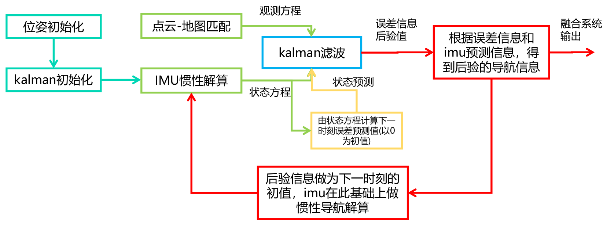

# Sensor Fusion: IMU-Lidar-GNSS Fusion -- 多传感器融合定位: 基于滤波的融合定位

This is the solution of Assignment 04 of Sensor Fusion from [深蓝学院](https://www.shenlanxueyuan.com/course/261).

深蓝学院从多传感器融合定位第4节IMU-Lidar-GNSS Fusion for Localization答案. 版权归深蓝学院所有. 请勿抄袭.

---

## Problem Statement

---

### 1. 基于滤波的融合定位

任选一种滤波模型和方法, 在`KITTI`数据集上, 实现基于`IMU`以及`点云地图匹配`的融合定位

#### ANS

此处选用`基于误差信息的Kalman Filtering`进行融合定位. 解决方案的架构图如下:

算法的`理论推导`以及`针对KITTI Road Test Data`的`伪代码实现`参考 [here](doc/derivations)

---

### 2. GNSS/IMU融合分析

推导组合导航(GNSS + IMU)的滤波模型. 要求:

* 对静止, 匀速, 转向, 加减速等不同运动状态下各状态量的可观测性和可观测度进行分析.

* 使用第三章所述数据仿真软件, 产生对应运动状态的数据, 进行Kalman滤波.

* 统计Kalman滤波中各状态量的收敛速度和收敛精度, 并与可观测度分析的结果汇总比较.

#### ANS
