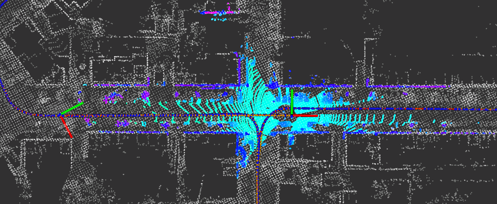
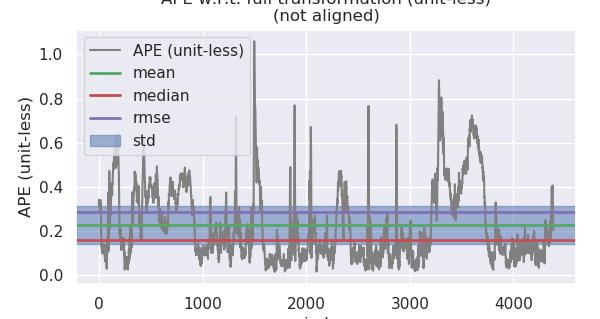
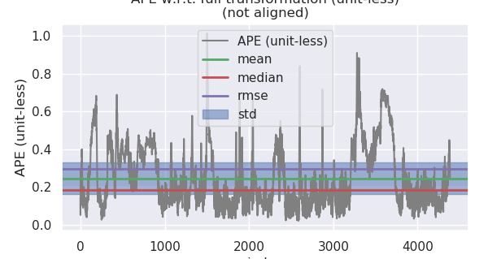
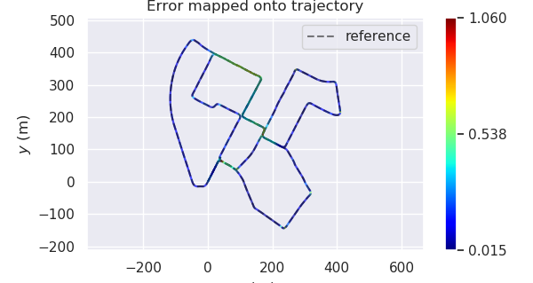
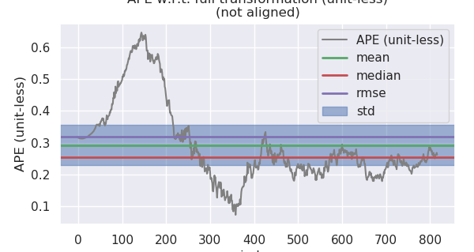
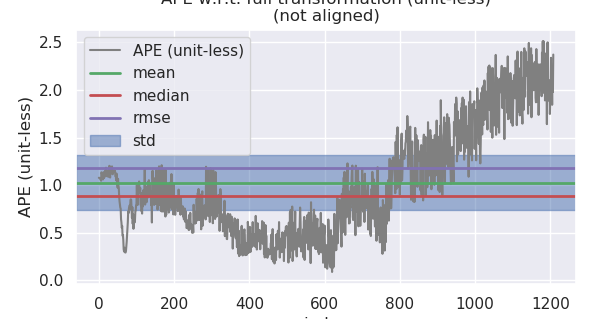
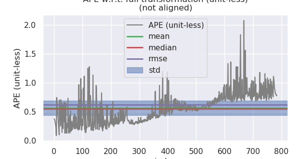

# Sensor Fusion: IMU-Lidar-GNSS Fusion -- 多传感器融合定位: 基于滤波的融合定位

This is the solution of Assignment 04 of Sensor Fusion from [深蓝学院](https://www.shenlanxueyuan.com/course/261).

深蓝学院从多传感器融合定位第4节IMU-Lidar-GNSS Fusion for Localization答案. 版权归深蓝学院所有. 请勿抄袭.

---

# Problem Statement

---

## 1. 基于滤波的融合定位

任选一种滤波模型和方法, 在`KITTI`数据集上, 实现基于`IMU`以及`点云地图匹配`的融合定位

### ANS

此处选用`基于误差信息的Kalman Filtering`进行融合定位. 解决方案的架构图如下:


算法的`理论推导`以及`针对KITTI Road Test Data`的`伪代码实现`参考 [here](doc/derivations)

### Data Preprocessing

为了产生`未降频的IMU测量值`:

1. 下载`extract.zip`

2. 解压后
    * 将`extract.zip`中的`oxts`重命名为`oxts_extract`, 拷贝至`sync`的文件目录下
    * 将`sync`中的`oxts`重命名为`oxts_sync`

3. 修复`extract oxts`测量值的`timestamp`异常. 原始`timestamp`差分的统计描述如下:

    ```bash
    count                       45699
    mean       0 days 00:00:00.010318
    std        0 days 00:00:00.022812
    min      -1 days +23:59:59.949989
    25%        0 days 00:00:00.009967
    50%        0 days 00:00:00.009996
    75%        0 days 00:00:00.010025
    max        0 days 00:00:01.919595
    ```

    使用[scripts](src/lidar_localization/scripts/generate_100hz_oxts.py)中的脚本进行修复, 修复后的`timestamp`差分统计描述如下:

    ```bash
    count                     50244
    mean     0 days 00:00:00.009384
    std      0 days 00:00:00.006092
    min             0 days 00:00:00
    25%      0 days 00:00:00.009953
    50%      0 days 00:00:00.009992
    75%      0 days 00:00:00.010021
    max      0 days 00:00:00.519616
    ```

4. 修改`kitti2bag`源代码, 将`IMU` `Linear Acceleration / Angular Velocity`测量值的坐标系改为`Body Frame(xyz)` [here](src/lidar_localization/scripts/kitti2bag.py#L39)
    
    ```python
    def save_imu_data(bag, kitti, imu_frame_id, topic):
    print("Exporting IMU")
    for timestamp, oxts in zip(kitti.timestamps, kitti.oxts):
        q = tf.transformations.quaternion_from_euler(oxts.packet.roll, oxts.packet.pitch, oxts.packet.yaw)
        imu = Imu()
        imu.header.frame_id = imu_frame_id
        imu.header.stamp = rospy.Time.from_sec(float(timestamp.strftime("%s.%f")))
        imu.orientation.x = q[0]
        imu.orientation.y = q[1]
        imu.orientation.z = q[2]
        imu.orientation.w = q[3]
        # change here:
        imu.linear_acceleration.x = oxts.packet.ax
        imu.linear_acceleration.y = oxts.packet.ay
        imu.linear_acceleration.z = oxts.packet.az
        imu.angular_velocity.x = oxts.packet.wx
        imu.angular_velocity.y = oxts.packet.wy
        imu.angular_velocity.z = oxts.packet.wz
        bag.write(topic, imu, t=imu.header.stamp)
    ```

5. 然后运行`kitti2bag`, 产生用于`LIO/VIO Filtering/Graph Optimization`的ROS Bag

6. 为了提高`lidar-IMU-GNSS`配准的精度, 方便`evo`的精度评估:

    * 删除`sync.bag`中的`/tf_static`, `/tf`
    * 保留`extract.bag`中的
        * `/tf_static`;
        * `/tf`;
        * `/kitti/oxts/imu`, 并将`/kitti/oxts/imu`重命名为`/kitti/oxts/imu/extract`;
        * `/kitti/oxts/gps/fix`, 并将`/kitti/oxts/gps/fix`重命名为`/kitti/oxts/gps/fix/extract`;
        * `/kitti/oxts/gps/vel`, 并将`/kitti/oxts/gps/vel`重命名为`/kitti/oxts/gps/vel/extract`;
    * 重命名时可使用ROS自带脚本:
        
        ```bash
        rosrun rosbag topic_renamer.py [INPUT_TOPIC] [INPUT_BAG] [OUTPUT_TOPIC] [OUTPUT_BAG] 
        ```

    * 合并上述两生成bag, 作为最终的`synced.bag`. 合并可用使用[scripts](src/lidar_localization/scripts/merge_bags.py)中的脚本.

在`kitti_2011_10_03_drive_0027_synced`上得到的ROS Bag Info如下:

```bash
$ rosbag info kitti_2011_10_03_drive_0027_synced.bag

path:        kitti_2011_10_03_drive_0027_synced.bag
version:     2.0
duration:    7:51s (471s)
start:       Oct 03 2011 20:55:34.93 (1317646534.93)
end:         Oct 03 2011 21:03:26.01 (1317647006.01)
size:        24.1 GB
messages:    283658
compression: none [18260/18260 chunks]
types:       geometry_msgs/TwistStamped [98d34b0043a2093cf9d9345ab6eef12e]
             sensor_msgs/CameraInfo     [c9a58c1b0b154e0e6da7578cb991d214]
             sensor_msgs/Image          [060021388200f6f0f447d0fcd9c64743]
             sensor_msgs/Imu            [6a62c6daae103f4ff57a132d6f95cec2]
             sensor_msgs/NavSatFix      [2d3a8cd499b9b4a0249fb98fd05cfa48]
             sensor_msgs/PointCloud2    [1158d486dd51d683ce2f1be655c3c181]
             tf2_msgs/TFMessage         [94810edda583a504dfda3829e70d7eec]
topics:      /kitti/camera_color_left/camera_info     4544 msgs    : sensor_msgs/CameraInfo    
             /kitti/camera_color_left/image_raw       4544 msgs    : sensor_msgs/Image         
             /kitti/camera_color_right/camera_info    4544 msgs    : sensor_msgs/CameraInfo    
             /kitti/camera_color_right/image_raw      4544 msgs    : sensor_msgs/Image         
             /kitti/camera_gray_left/camera_info      4544 msgs    : sensor_msgs/CameraInfo    
             /kitti/camera_gray_left/image_raw        4544 msgs    : sensor_msgs/Image         
             /kitti/camera_gray_right/camera_info     4544 msgs    : sensor_msgs/CameraInfo    
             /kitti/camera_gray_right/image_raw       4544 msgs    : sensor_msgs/Image         
             /kitti/oxts/gps/fix                      4544 msgs    : sensor_msgs/NavSatFix     
             /kitti/oxts/gps/fix/extract             45826 msgs    : sensor_msgs/NavSatFix     
             /kitti/oxts/gps/vel                      4544 msgs    : geometry_msgs/TwistStamped
             /kitti/oxts/gps/vel/extract             45826 msgs    : geometry_msgs/TwistStamped
             /kitti/oxts/imu                          4544 msgs    : sensor_msgs/Imu           
             /kitti/oxts/imu/extract                 45826 msgs    : sensor_msgs/Imu           
             /kitti/velo/pointcloud                   4544 msgs    : sensor_msgs/PointCloud2   
             /tf                                     45826 msgs    : tf2_msgs/TFMessage        
             /tf_static                              45826 msgs    : tf2_msgs/TFMessage

```

### Implementation

基于`Eigen`与`Sophus`的`Error-State Kalman Fusion`实现参考[here](src/lidar_localization/src/models/kalman_filter/kalman_filter.cpp)

### Demo

`IMU-Lidar Error-State Kalman Fusion Odometry`与`GNSS Groud Truth`的对比如下图所示. 其中`黄色`为`GNSS Groud Truth`, `红色`为`Lidar Odometry`, `蓝色`为`IMU-Lidar Fusion Odometry`:




### Result Analysis

为了获取可用于`evo评估`的轨迹输出, 可通过如下`ROS Service Call`, 比较融合前后的Odometry: 

```bash
# set up session:
source install/setup.bash
# save odometry:
rosservice call /save_odometry "{}"
# run evo evaluation:
# a. laser:
evo_ape kitti ground_truth.txt laser.txt -r full --plot --plot_mode xy
# b. fused:
evo_ape kitti ground_truth.txt fused.txt -r full --plot --plot_mode xy
```

两者的KPI比较参照下表. 

在`2011_10_03_drive_0027_extract`上, 两者的估计性能相近, `IMU-Lidar Fusion`的

* 估计精度(Standard Deviation)

* 误差的散布度(Max - Min)

略优, 在`Standard Deviation`上, 相比Lidar Frontend的直接估计, 基于IMU-Lidar Fusion的里程计有**1%**的提升.

Lidar Only                 |IMU-Lidar Fusion
:-------------------------:|:-------------------------:
  |  
  |  

|  Algo. |  Lidar Only  |  IMU-Lidar   |
|:------:|:------------:|:------------:|
|   max  |   1.059857   |   1.013975   |
|  mean  |   0.228051   |   0.244695   |
| median |   0.160213   |   0.185263   |
|   min  |   0.015406   |   0.020395   |
|  rmse  |   0.284716   |   0.297277   |
|   sse  |  355.463371  |  387.517623  |
| **std**| **0.170458** | **0.168813** |		

---

## 2. GNSS/IMU融合分析

推导组合导航(GNSS + IMU)的滤波模型. 要求:

* 对静止, 匀速, 转向, 加减速等不同运动状态下各状态量的可观测性和可观测度进行分析.

* 使用第三章所述数据仿真软件, 产生对应运动状态的数据, 进行Kalman滤波.

* 统计Kalman滤波中各状态量的收敛速度和收敛精度, 并与可观测度分析的结果汇总比较.

### ANS

### Measurement Model Derivation

组合导航(GNSS + IMU)的滤波模型参考 [here](doc/derivations).

### Data Pre-processing

#### ROS GNSS-INS-Sim

为了简化算法的比较与分析, 首先重新实现`GNSS-INS-Sim ROS Wrapper Package`, 将`GNSS-INS-Sim`的输出转化为与`KITTI Road Test Data`兼容的格式. 以加减速场景的测试数据为例, 得到的ROS Bag如下. 其中`/init_pose`为起始点, `/reference_pose`为`Groud Truth Trajectory`.

```bash
$ rosbag info acc.bag

path:        acc.bag
version:     2.0
duration:    40.0s
start:       Nov 18 2020 15:15:21.78 (1605683721.78)
end:         Nov 18 2020 15:16:01.77 (1605683761.77)
size:        5.6 MB
messages:    16001
compression: none [8/8 chunks]
types:       geometry_msgs/TwistStamped [98d34b0043a2093cf9d9345ab6eef12e]
             nav_msgs/Odometry          [cd5e73d190d741a2f92e81eda573aca7]
             sensor_msgs/Imu            [6a62c6daae103f4ff57a132d6f95cec2]
             sensor_msgs/NavSatFix      [2d3a8cd499b9b4a0249fb98fd05cfa48]
topics:      /init_pose               1 msg     : nav_msgs/Odometry         
             /reference_pose       4000 msgs    : nav_msgs/Odometry         
             /sim/sensor/gps/fix   4000 msgs    : sensor_msgs/NavSatFix     
             /sim/sensor/gps/vel   4000 msgs    : geometry_msgs/TwistStamped
             /sim/sensor/imu       4000 msgs    : sensor_msgs/Imu
```

#### GNSS-INS-Sim Preprocessing Node

同时增加新的数据预处理节点`eskf_preprocess_node` [here](src/lidar_localization/src/apps/eskf_preprocess_node.cpp), 完成:

* `LLA`位置向`ENU`系位置的转换.

* `NED`系速度向`ENU`系速度的转换.

#### ESKF with Observability Analysis

最后, 将`Observability Analysis`分析的逻辑集成至`IMUGNSSFilteringFlow`:

* 首先重构`Kalman Filter`[here](src/lidar_localization/include/lidar_localization/models/kalman_filter/kalman_filter.hpp#L23),  使ESKF可支持GNSS观测值, ESKF可产生融合后的轨迹

IMU-GNSS ESKF, Acc         |IMU-GNSS ESKF, Turning
:-------------------------:|:-------------------------:
  |  

* 然后在`Kalman Filter`中, 增加`可观测性`以及`可观测度`分析的模块, 并将所得数据写至可持续性存储, 方便后续分析.

### Result & Analysis

#### Localization Precision

融合前后定位精度的对比如下. 数据显示在四种典型运动模式下, `ESKF`均可显著提升定位精度.

| Scenario |  **Static**  | **Const. Velocity** |  **Turning** | **Acc & Deacc** |
|:--------:|:------------:|:-------------------:|:------------:|:---------------:|
|   GNSS   |   0.329272   |       0.336505      |   0.818692   |     0.349645    |
| IMU-GNSS | **0.126026** |     **0.137684**    | **0.578781** |   **0.254300**  |

Static, GNSS Only          |Static, IMU-GNSS
:-------------------------:|:-------------------------:
  |  

Const. Velocity, GNSS Only |Const. Velocity, IMU-GNSS
:-------------------------:|:-------------------------:
  |  

Turning, GNSS Only         |Turning, IMU-GNSS
:-------------------------:|:-------------------------:
  |  

Acc & Deacc, GNSS Only     |Acc & Deacc, IMU-GNSS
:-------------------------:|:-------------------------:
  |  

#### Observability Analysis

##### Workflow

`可观测性`和`可观测度`的分析流程如下:

* 首先对给定时刻的`SOM矩阵`进行`SVD`分解;

* 然后假设观测值存在`方差相同的高斯白噪声`, 反向求解状态值, 确定状态的`可观测度`;

    ```c++
    VectorX X = (
        svd.matrixV()*
        svd.singularValues().asDiagonal().inverse()*
        svd.matrixU().transpose()
    )*Y;
    ```
* 将不同时刻采样得到的`奇异值`以及状态的`可观测度`, 以CSV格式写入`可持续性存储`, 汇总为`TOM`所需的分析数据;

* 使用Python工具链, 分析系统的`可观测性`与`可观测度`.

##### Observability using SVD

四种典型运动模式的`可观测性`与`可观测度`测量数据如下表所示. 完整的测量数据请点击 [here](doc/results/observability). 数据显示:

* 四种典型运动模式下TOM的秩均为`12`

* 在不同的运动模式下, 状态量的`可观测度`不同. 

    * `Static`与`Const. Velocity`模式下可观测度相近且`较低`

    * `Turning`与`Acc & Deacc`模式下可观测度会提高, 且运动越剧烈, 可观测度越高(参见完整测量数据). 

| Attribute |    **Static**    | **Const. Velocity** |    **Turning**   |  **Acc & Deacc** |
|:---------:|:----------------:|:-------------------:|:----------------:|:----------------:|
|   s.v.01  | **9.845140e+00** |   **9.843860e+01**  | **1.170830e+01** | **1.211910e+01** |
|   s.v.02  | **9.845140e+00** |   **9.843860e+01**  | **1.170830e+01** | **1.211910e+01** |
|   s.v.03  | **9.794220e+00** |   **9.792940e+01**  | **1.166550e+01** | **1.207780e+01** |
|   s.v.04  | **9.794220e+00** |   **9.792940e+01**  | **1.166550e+01** | **1.207780e+01** |
|   s.v.05  | **1.000000e+00** |   **1.000000e+00**  | **1.000000e+00** | **1.000000e+00** |
|   s.v.06  | **1.000000e+00** |   **1.000000e+00**  | **1.000000e+00** | **1.000000e+00** |
|   s.v.07  | **1.000000e+00** |   **1.000000e+00**  | **1.000000e+00** | **1.000000e+00** |
|   s.v.08  | **1.000000e+00** |   **1.000000e+00**  | **1.000000e+00** | **1.000000e+00** |
|   s.v.09  | **1.000000e+00** |   **1.000000e+00**  | **1.000000e+00** | **1.000000e+00** |
|   s.v.10  | **1.000000e+00** |   **1.000000e+00**  | **1.000000e+00** | **1.000000e+00** |
|   s.v.11  | **1.000000e+00** |   **1.000000e+00**  | **1.000000e+00** | **1.000000e+00** |
|   s.v.12  | **5.927110e-04** |   **5.675480e-04**  | **4.076120e-04** | **8.804910e-04** |
|   s.v.13  |   3.291100e-23   |     2.417900e-23    |   1.898810e-19   |   6.792180e-17   |
|   s.v.14  |   3.019380e-26   |     2.004200e-26    |   5.231300e-25   |   4.125640e-21   |
|   s.v.15  |   6.692570e-29   |     4.949860e-29    |   2.043330e-27   |   6.474930e-24   |
|    dPx    | **2.500000e-01** |   **2.500000e-01**  | **2.500000e-01** | **2.500000e-01** |
|    dPy    | **2.500000e-01** |   **2.500000e-01**  | **2.500000e-01** | **2.500000e-01** |
|    dPz    | **2.500000e-01** |   **2.500000e-01**  | **2.500000e-01** | **2.500000e-01** |
|    dVx    | **2.500000e-01** |   **2.500000e-01**  | **2.500000e-01** | **2.500000e-01** |
|    dVy    | **2.500000e-01** |   **2.500000e-01**  | **2.500000e-01** | **2.500000e-01** |
|    dVz    | **2.500000e-01** |   **2.500000e-01**  | **2.500000e-01** | **2.500000e-01** |
|  dThetaE  |   5.221730e+20   |     2.953540e+21    |   3.660580e+21   |   3.180150e+21   |
|  dThetaN  |   2.648520e+21   |     1.082380e+23    |   6.418890e+20   |   2.288700e+21   |
|  dThetaU  |   1.609800e+20   |     6.857130e+21    |   1.439400e+21   |   6.538200e+21   |
|    dGBx   |   1.707300e+18   |     6.725180e+18    |   2.914100e+17   |   5.112470e+17   |
|    dGBy   |   2.095290e+16   |     6.241560e+16    |   3.408750e+16   |   6.221240e+16   |
|    dGBz   |   1.254210e+17   |     2.609740e+17    |   2.909930e+16   |   1.782630e+17   |
|    dABx   |   1.585440e+21   |     9.583680e+23    |   1.896390e+23   |   6.838070e+19   |
|    dABy   |   4.756790e+20   |     2.708440e+20    |   8.967510e+18   |   3.227030e+20   |
|    dABz   |   3.638080e+16   |     1.912320e+16    |   6.274590e+18   |   7.822130e+18   | 

##### ESKF Convergence

四种典型运动模式的`ESKF收敛速度`如下图所示. 数据显示: `Turning`与`Acc & Deacc`模式下, `ESKF`收敛速度优于`Static`与`Const. Velocity`模式

Static                    |Const. Velocity
:-------------------------:|:-------------------------:
  |  

Turning                    |Acc & Deacc
:-------------------------:|:-------------------------:
  |  

##### Conclusion

`可观测性`与`可观测度`的分析结果总结如下:

* `IMU-GUSS ESKF Fusion`的`TOM`秩为`12`(Singular Value Threshold @ `1.0e-05`)

* `静止`与`匀速运动`下, 模型的`可观测度`最低, 此时估计值的收敛速度为`最慢`;

* `旋转`与`加/减速`:
    
    * 均可`提升模型的可观测度`, 进而`提升ESKF的收敛速度`.
    
    * 在这两种运动模式下, `运动越剧烈, 可观测度越高, ESKF的收敛速度越快`. 
