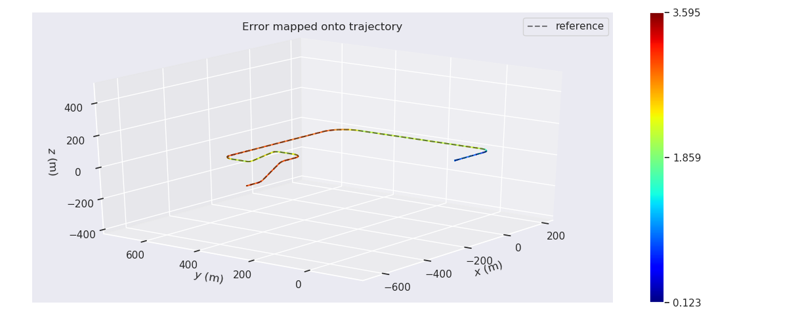
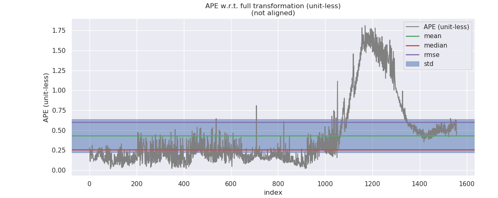
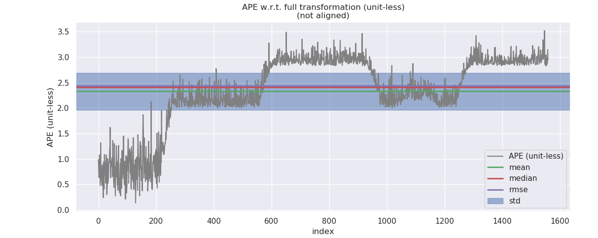
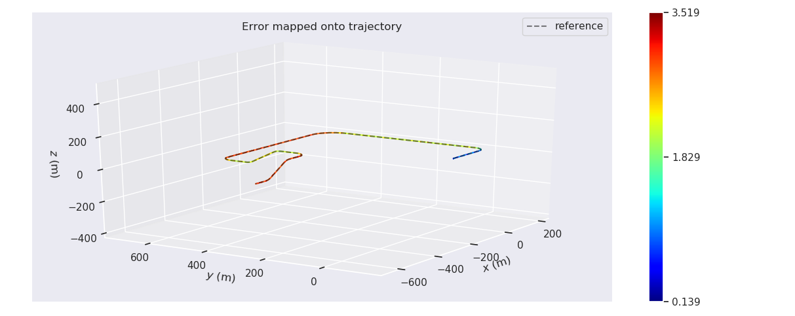

# Sensor Fusion: IMU Fusion for Localization, Advanced Topics -- 多传感器融合定位: 基于滤波的融合定位进阶

This is the solution of Assignment 05 of Sensor Fusion from [深蓝学院](https://www.shenlanxueyuan.com/course/261).

深蓝学院从多传感器融合定位第5节IMU Fusion for Localization, Advanced Topics答案. 版权归深蓝学院所有. 请勿抄袭.

**WARNING** ONLY Reproducible using Corresponding Docker Environment. Not Responsible for Custom Env. Adaptation.

---

# Problem Statement

---

## 1. 基于运动约束的滤波

在`KITTI`数据集上, 实现基于`运动约束模型`的融合定位

### ANS

#### Data Preprocessing 

首先修改`data_pretreat_flow`, 增加对组合导航输出的位置-速度信息的订阅.

#### ESKF & IEKF with Motion Constraints

接着重构`ESKF/IEKF`, 增加下列实现

* 使用运动约束的观测方程 
    * [ESKF](src/lidar_localization/src/models/kalman_filter/extended_kalman_filter.cpp#L688)
    * [IEKF](src/lidar_localization/src/models/kalman_filter/error_state_kalman_filter.cpp#L688)

* 增加输出时的运动约束 
    * [ESKF](src/lidar_localization/src/models/kalman_filter/extended_kalman_filter.cpp#L411)
    * [IEKF](src/lidar_localization/src/models/kalman_filter/error_state_kalman_filter.cpp#L355)

#### Results & Analysis

测试数据选择`kitti_2011_10_03_drive_0027_synced`.


##### Fusion Config

```yaml
# select fusion method for IMU-Lidar-GNSS-Odo, available methods are:
#     1. extended_kalman_filter
#     2. error_state_kalman_filter
fusion_method: error_state_kalman_filter
```

##### EVO, Time Series Plot

`No Constraint`与`With Constraint`的误差对比如下:

No Constraint              |With Constraint
:-------------------------:|:-------------------------:
  |  

##### EVO, 3D Map Plot

`No Constraint`与`With Constraint`的误差对比如下:

No Constraint              |With Constraint
:-------------------------:|:-------------------------:
  |  

##### EVO, Standard Deviation

三者的估计精度如下

* `With Constraint`的精度(Standard Deviation), 相比`No Constraint`没有提升.

* 但从`EVO Time Series Plot`上来看, `With Constraint`的情况下, 误差的波动性相比`No Constraint`有显著提升.

|        Algo.       | No Constraint | With Constraint |
|:------------------:|:-------------:|:---------------:|
| Standard Deviation |    0.151242   |   **0.166400**  |

---

## 2. IMU-GNSS-Odo滤波

基于`GNSS-INS-Sim`仿真数据, 实现`IMU-GNSS-Odo`滤波融合算法

### ANS

#### Data Generation

首先修改`ROS GNSS-INS-Sim Wrapper` [here](src/gnss_ins_sim/README.md) 产生所需的仿真数据. 为了抑制`IEKF`解算的数值误差, 此处设置GNSS-INS-Sim的仿真频率为`400Hz`. 一个示例数据如下图所示:

```bash
$ rosbag info virtual_proving_ground.bag 

path:        virtual_proving_ground.bag
version:     2.0
duration:    2:35s (155s)
start:       Nov 26 2020 11:06:50.94 (1606360010.94)
end:         Nov 26 2020 11:09:26.94 (1606360166.94)
size:        105.4 MB
messages:    374401
compression: none [135/135 chunks]
types:       geometry_msgs/TwistStamped [98d34b0043a2093cf9d9345ab6eef12e]
             nav_msgs/Odometry          [cd5e73d190d741a2f92e81eda573aca7]
             sensor_msgs/Imu            [6a62c6daae103f4ff57a132d6f95cec2]
             sensor_msgs/MagneticField  [2f3b0b43eed0c9501de0fa3ff89a45aa]
             sensor_msgs/NavSatFix      [2d3a8cd499b9b4a0249fb98fd05cfa48]
topics:      /init_pose                1 msg     : nav_msgs/Odometry         
             /reference_pose       62400 msgs    : nav_msgs/Odometry         
             /sim/sensor/gps/fix   62400 msgs    : sensor_msgs/NavSatFix     
             /sim/sensor/gps/vel   62400 msgs    : geometry_msgs/TwistStamped
             /sim/sensor/imu       62400 msgs    : sensor_msgs/Imu           
             /sim/sensor/imu/mag   62400 msgs    : sensor_msgs/MagneticField 
             /sim/sensor/odo       62400 msgs    : geometry_msgs/TwistStamped

```

#### Data Preprocessing

接着在框架中增加新的节点, 实现`GNSS`观测值的预处理, 以及融合节点对位置观测与速度观测的订阅.

#### ESKF for IMU-GNSS-Odo Fusion

接着重构`ErrorStateKalmanFilter`, 实现基于`GNSS-Odo`观测值的校正. 代码实现参考 [here](src/lidar_localization/src/models/kalman_filter/error_state_kalman_filter.cpp#L648)

#### Results & Analysis

测试数据如下图所示. 该数据模拟了自动驾驶车辆上下高架桥的过程. 测试路段的三维构型参照EVO的评测结果.


##### Fusion Config

```yaml
# select fusion method for IMU-GNSS-Odo, available methods are:
#     1. extended_kalman_filter
#     2. error_state_kalman_filter
fusion_method: error_state_kalman_filter
# select fusion strategy for IMU-GNSS-Odo, available methods are:
#     1. pose
#     2. position
#     3. position_velocity
#     4. position_magnetic_field
#     5. position_velocity_magnetic_field
fusion_strategy: position_velocity
```
##### Observability Analysis

针对自动驾驶车辆的运动:

* `各运动阶段`对应的`可观测性&可观测度`分析参见 [here](doc/observability/02-eskf--position-velocity-observability.csv). 
    * 在每一时刻, `IMU-GNSS-Odom ESKF Fusion`的`Q`秩为`14`
    * `Accel Bias Y`不可观
    * 当车辆有`最高运动速度`且`转向`时, 系统的可观测度最高, 对应运动阶段为`5`, `6`和`7`
* `整个运动过程中`, `可观测性&可观测度`的变化 [here](doc/observability/02-eskf--position-velocity-observability-som.csv). 
    * 在车辆完成加速后, `IMU-GNSS-Odom ESKF Fusion`的`Qso`秩由`14`变为`15`, 此后系统变为`完全可观`

##### EVO, Time Series Plot

`GNSS Only`与`IMU-GNSS-Odo Fusion`的误差对比如下:

GNSS Only                  |IMU-GNSS-Odo Fusion
:-------------------------:|:-------------------------:
  |  

##### EVO, 3D Map Plot

`GNSS Only`与`IMU-GNSS-Odo Fusion`的误差对比如下:

GNSS Only                  |IMU-GNSS-Odo Fusion
:-------------------------:|:-------------------------:
  |  

##### EVO, Standard Deviation

三者的估计精度如下. `IMU-GNSS-Odo Fusion`的精度, 相比`GNSS-Only`有~25%的显著提升.

|        Algo.       | GNSS Only | IMU-GNSS-Odo Fusion |
|:------------------:|:---------:|:-------------------:|
| Standard Deviation |  0.728081 |     **0.542979**    |

---

## 3. IMU-GNSS-Mag

基于`GNSS-INS-Sim`仿真数据, 实现`IMU-GNSS-Mag`滤波融合算法

### ANS

此处选择`Iterative Extended Kalman Filter`, 基于`导航信息`, 进行`IMU-GNSS-Odo-Mag`观测值的融合定位. 解决方案架构图如下, 此处使用课程中的`Loosely-Coupled Lidar Estimation`为例进行说明:


#### Data Preprocessing

首先在框架中增加新的节点, 实现`GNSS`观测值的预处理, 以及融合节点对`位置观测`, `速度观测`与`磁场强度观测`的订阅.

#### EKF for IMU-GNSS-Odo Fusion

接着实现`IterativeExtendedKalmanFilter`, 实现基于`导航信息`的`GNSS-Odo / GNSS-Mag / GNSS-Odo-Mag`观测值的校正. 代码实现参考 [here](src/lidar_localization/src/models/kalman_filter/extended_kalman_filter.cpp#L783)

#### Results & Analysis

测试数据如下图所示. 该数据模拟了自动驾驶车辆上下高架桥的过程. 测试路段的三维构型参照EVO的评测结果.


##### Fusion Config

```yaml
# select fusion method for IMU-GNSS-Odo-Mag, available methods are:
#     1. extended_kalman_filter
#     2. error_state_kalman_filter
fusion_method: extended_kalman_filter
# select fusion strategy for IMU-GNSS-Odo-Mag, available methods are:
#     1. pose
#     2. position
#     3. position_velocity
#     4. position_magnetic_field
#     5. position_velocity_magnetic_field
fusion_strategy: position_velocity_magnetic_field
```

##### Observability Analysis

各运动阶段对应的`可观测性&可观测度`分析参见 [here](doc/observability/03-iekf--position-velocity-magneto-observability.csv). 针对自动驾驶车辆的运动:

* `IMU-GNSS-Odom-Mag IEFK Fusion`的`TOM`秩为`16`

##### EVO, Time Series Plot

`GNSS Only`, `IMU-GNSS-Mag Fusion`与`IMU-GNSS-Odo Fusion`, 以及`IMU-GNSS-Odo-Mag Fusion`的误差对比如下:

IMU-GNSS-Mag Fusion        |IMU-GNSS-Odo Fusion
:-------------------------:|:-------------------------:
  |  

IMU-GNSS-Odo-Mag Fusion    |GNSS Only
:-------------------------:|:-------------------------:
  |  

##### EVO, 3D Map Plot

`GNSS Only`, `IMU-GNSS-Mag Fusion`与`IMU-GNSS-Odo Fusion`, 以及`IMU-GNSS-Odo-Mag Fusion`的误差对比如下:

IMU-GNSS-Mag Fusion        |IMU-GNSS-Odo Fusion
:-------------------------:|:-------------------------:
  |  

IMU-GNSS-Odo-Mag Fusion    |GNSS Only
:-------------------------:|:-------------------------:
  |  

##### EVO, Standard Deviation

三者的估计精度对比如下. `IMU-GNSS-Odo-Mag Fusion`的精度, 相比`GNSS-Only`有~60%的显著提升.

* `Odo & Motion Constraint`对`IEKF`的精度提升最为显著;

* `Magnetometer`对提升精度亦有帮助.

|        Algo.       | GNSS Only | IMU-GNSS-Mag Fusion | IMU-GNSS-Odo Fusion | IMU-GNSS-Odo-Mag Fusion 
|:------------------:|:---------:|:-------------------:|:-------------------:|:-----------------------:
| Standard Deviation |  0.726113 |      0.634136       |       0.396074      |      **0.285830**      