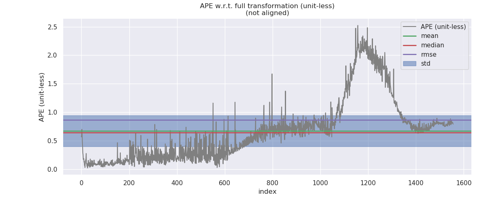

# Sensor Fusion: IMU Fusion for Localization, Advanced Topics -- 多传感器融合定位: 基于滤波的融合定位进阶

This is the solution of Assignment 05 of Sensor Fusion from [深蓝学院](https://www.shenlanxueyuan.com/course/261).

深蓝学院从多传感器融合定位第5节IMU Fusion for Localization, Advanced Topics答案. 版权归深蓝学院所有. 请勿抄袭.

---

# Problem Statement

---

## 1. 基于运动约束的滤波

在`KITTI`数据集上, 实现基于`运动约束模型`的融合定位

### ANS

---

## 2. IMU-GNSS-Odo滤波

基于`GNSS-INS-Sim`仿真数据, 实现`IMU-GNSS-Odo`滤波融合算法

### ANS

#### Data Generation

首先修改`ROS GNSS-INS-Sim Wrapper` [here](src/gnss_ins_sim/README.md) 产生所需的仿真数据. 一个示例数据如下图所示:

```bash
$ rosbag info virtual_proving_ground.bag 

path:        virtual_proving_ground.bag
version:     2.0
duration:    1:37s (97s)
start:       Nov 21 2020 07:34:38.69 (1605944078.69)
end:         Nov 21 2020 07:36:16.68 (1605944176.68)
size:        16.6 MB
messages:    58801
compression: none [22/22 chunks]
types:       geometry_msgs/TwistStamped [98d34b0043a2093cf9d9345ab6eef12e]
             nav_msgs/Odometry          [cd5e73d190d741a2f92e81eda573aca7]
             sensor_msgs/Imu            [6a62c6daae103f4ff57a132d6f95cec2]
             sensor_msgs/MagneticField  [2f3b0b43eed0c9501de0fa3ff89a45aa]
             sensor_msgs/NavSatFix      [2d3a8cd499b9b4a0249fb98fd05cfa48]
topics:      /init_pose               1 msg     : nav_msgs/Odometry         
             /reference_pose       9800 msgs    : nav_msgs/Odometry         
             /sim/sensor/gps/fix   9800 msgs    : sensor_msgs/NavSatFix     
             /sim/sensor/gps/vel   9800 msgs    : geometry_msgs/TwistStamped
             /sim/sensor/imu       9800 msgs    : sensor_msgs/Imu           
             /sim/sensor/imu/mag   9800 msgs    : sensor_msgs/MagneticField 
             /sim/sensor/odo       9800 msgs    : geometry_msgs/TwistStamped
```

#### Data Preprocessing

接着在框架中增加新的节点, 实现`GNSS`观测值的预处理, 以及融合节点对位置观测与速度观测的订阅.

#### ESKF for IMU-GNSS-Odo Fusion

接着重构`ErrorStateKalmanFilter`, 实现基于`GNSS-Odo`观测值的校正. 代码实现参考 [here](src/lidar_localization/src/models/kalman_filter/kalman_filter.cpp#L648)

#### Results & Analysis

测试数据如下图所示. 


`GNSS Only`, `IMU-GNSS Fusion`与`IMU-GNSS-Odo Fusion`的误差对比如下:

GNSS Only                  |IMU-GNSS Fusion            |IMU-GNSS-Odo Fusion
:-------------------------:|:-------------------------:|:-------------------------:
  |    |  
  |    |  

三者的估计精度如下. `IMU-GNSS-Odo Fusion`的精度, 相比`IMU-GNSS Fusion`有~40%的显著提升.

|        Algo.       | GNSS Only | IMU-GNSS Fusion | IMU-GNSS-Odo Fusion |
|:------------------:|:---------:|:---------------:|:-------------------:|
| Standard Deviation |  0.841071 |     0.551382    |     **0.332923**    |

---

### 3. IMU-GNSS-Mag

基于`GNSS-INS-Sim`仿真数据, 实现`IMU-GNSS-Mag`滤波融合算法

#### ANS