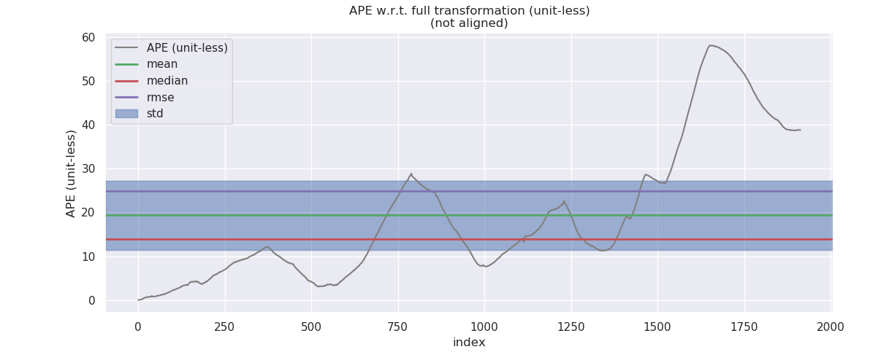
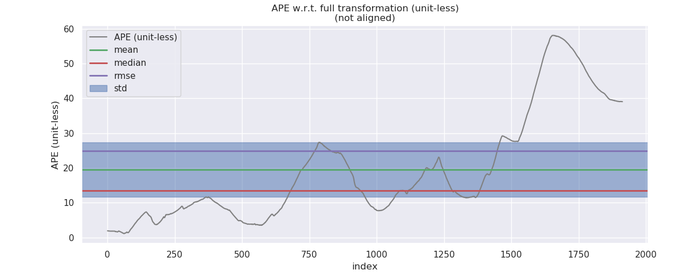
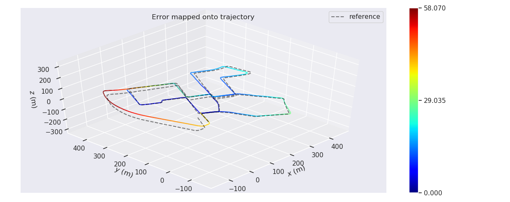
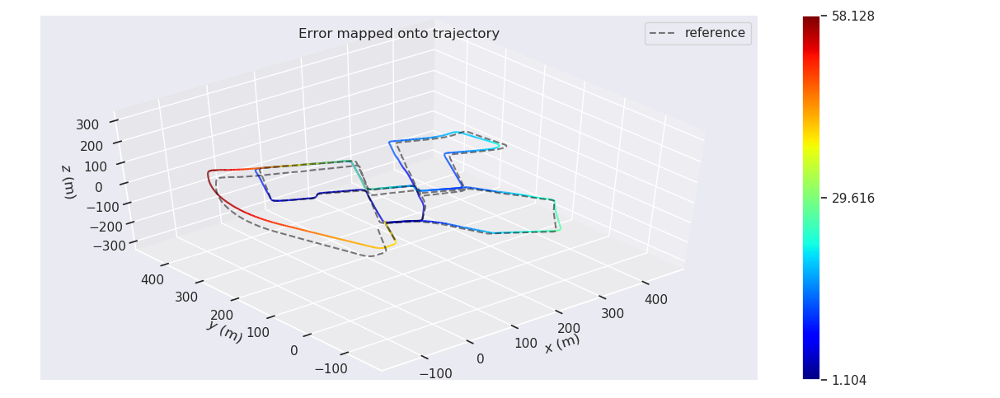

# Sensor Fusion: Graph Optimization for Lidar Mapping -- 多传感器融合定位: 基于图优化的建图

This is the solution of Assignment 06 of Sensor Fusion from [深蓝学院](https://www.shenlanxueyuan.com/course/261).

深蓝学院从多传感器融合定位第6节Graph Optimization for Lidar Mapping答案. 版权归深蓝学院所有. 请勿抄袭.

---

## Problem Statement

---

## 1. 在KITTI上, 实现基于IMU的预积分融合激光建图

### ANS

#### LIO-G2O Implementation

首先实现基于G2O的LIO Mapping. 包括:

* IMU Pre-Integration [here](src/lidar_localization/src/models/pre_integrator/imu_pre_integrator.cpp#178)
* G2O Vertex / Edge for IMU Pre-Integration
    * LIO Key Frame Vertex [here](src/lidar_localization/include/lidar_localization/models/graph_optimizer/g2o/vertex/vertex_prvag.hpp)
    * IMU Pre-Integration Edge [here](src/lidar_localization/include/lidar_localization/models/graph_optimizer/g2o/edge/edge_prvag_imu_pre_integration.hpp)

然后实现`LIO Backend`, 将`IMU Pre-Integration`集成至Mapping框架.

#### Results & Analysis

`LIO Mapping`得到的轨迹估计如下图所示. 其中红色为`Lidar Frontend`的估计, 绿色为`LIO Mapping`的估计. 优化后的轨迹与黄色的`GNSS Ground Truth`重合较好:

使用`IMU Pre-Integration`修正前后, 轨迹估计误差的对比如下所示:

Before                     |After
:-------------------------:|:-------------------------:
  |  
  |  

|  Prop. |   Before      |  After        |
|:------:|:-------------:|:-------------:|
|   std  |   10.509073   |   10.371566   |

由上述结果可知, `IMU Pre-Integration`的使用, `可以显著提升轨迹估计精度`.

在`LIO Mapping`得到的地图上

* 系统基于`ESKF`与`IEKF`的融合定位能够稳定运行
* 观测到的点云与地图中的点云重合度良好

测试的结果如下图所示. 结果显示`LIO Mapping 建图质量良好`.

---

## 2. 基于Odometer的预积融合分方法

推导基于编码器的预积分方法, 包括:

1. 预积分模型
2. 预积分残差的设计
3. 预积分方差的递推
4. 预积分对各状态量扰动的雅可比

推导思路可参考论文 `VINS on wheels`

### ANS

---

## 3. 在KITTI上, 实现基于IMU-Odometer的预积分融合激光建图

### ANS

---

