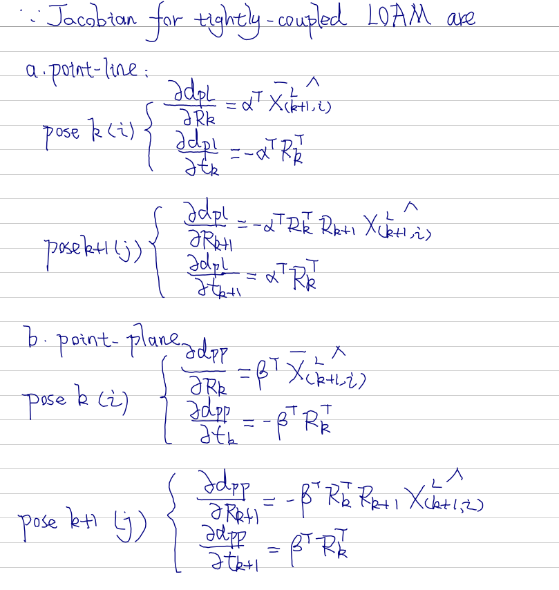
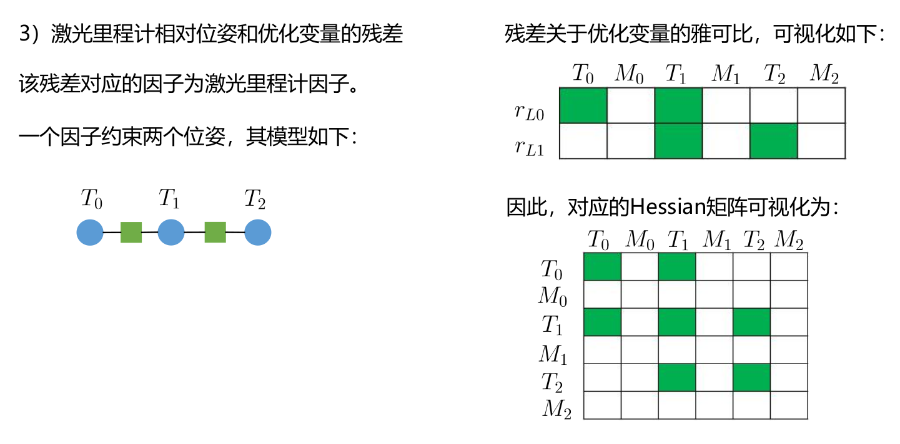
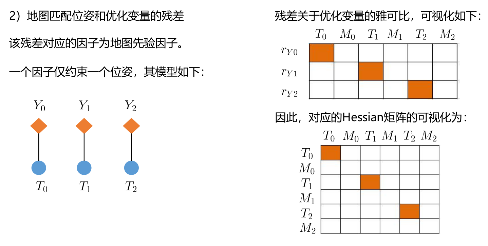
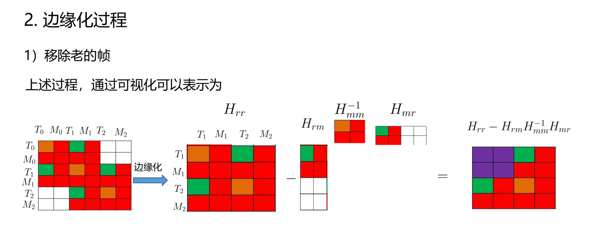

# Sensor Fusion: Sliding Window for Real-Time Lidar Localization -- 多传感器融合定位: 基于滑动窗口的实时定位

This is the solution of Assignment 07 of Sensor Fusion from [深蓝学院](https://www.shenlanxueyuan.com/course/261).

深蓝学院从多传感器融合定位第7节Sliding Window for Real-Time Localization答案. 版权归深蓝学院所有. 请勿抄袭.

---

## Problem Statement

---

## 1. 推导使用LOAM构建残差时, 与之相关联的两个位姿的Jacobian

### ANS

完整的推导过程参见[here](doc/derivation/01-loam-jacobians.pdf). 此处仅将结论摘录如下, 详细的符号定义参考推导文档.



---

## 2. 实现基于Sliding-Window的实时定位(Will be Polished by 10/01/2021)

### ANS 

算法中的关键计算步骤的推导参考[here](doc/derivation/02-ceres-implementation.pdf)

简化后的**sliding-window backend using Ceres**如下. 完整实现请参考[here](src/lidar_localization/src/models/sliding_window/ceres_sliding_window.cpp#L200). 

#### Problem

```c++
    //
    // config optimizer:
    // 
    // a. loss function:
    config_.loss_function_ptr = std::make_unique<ceres::CauchyLoss>(1.0);

    // b. solver:
    config_.options.linear_solver_type = ceres::DENSE_SCHUR;
    // config_.options.use_explicit_schur_complement = true;
    config_.options.trust_region_strategy_type = ceres::DOGLEG;
    // config_.options.use_nonmonotonic_steps = true;
    config_.options.num_threads = 2;
    config_.options.max_num_iterations = 1000;
    config_.options.max_solver_time_in_seconds = 0.10;
    // config_.options.minimizer_progress_to_stdout = true;

    // create new sliding window optimization problem:
    ceres::Problem problem;
```

#### ParameterBlock

此处使用**so3**对Orientation进行参数化. 相对应的**Ceres LocalParameterization**的实现参考[here](src/lidar_localization/include/lidar_localization/models/sliding_window/params/param_prvag.hpp)

```c++
    // b. ParameterBlock -- PRVAG for each pose inside the sliding window
    //        there are N + 1 extended poses in total
    //            [p + 0, ..., p + N] 
    //        N is the sliding window size
    for ( int i = 1; i < kWindowSize + 1; ++i) {
        auto &target_key_frame = optimized_key_frames_.at(N - i);

        ceres::LocalParameterization *local_parameterization = new sliding_window::ParamPRVAG();

        problem.AddParameterBlock(target_key_frame.prvag, 15, local_parameterization);

        if ( target_key_frame.fixed ) {
            problem.SetParameterBlockConstant(target_key_frame.prvag);
        }
    }
```

#### ResidualBlock

##### Relative Pose from Lidar Frontend



**Relative Pose Constraint**相对应的**Ceres SizedCostFunction**的实现参考[here](src/lidar_localization/include/lidar_localization/models/sliding_window/factors/factor_prvag_relative_pose.hpp)

```c++
    // c.1. ResidualBlock, relative pose from lidar frontend
    //        there are N relative pose residuals in total
    //            [(p + 0, p + 1), ..., (p + N - 1, p + N)]
    //        N is the sliding window size
    if ( !residual_blocks_.relative_pose.empty() ) {
        for ( const auto &residual_relative_pose: residual_blocks_.relative_pose ) {
            auto &key_frame_i = optimized_key_frames_.at(residual_relative_pose.param_index_i);
            auto &key_frame_j = optimized_key_frames_.at(residual_relative_pose.param_index_j);

            sliding_window::FactorPRVAGRelativePose *factor_relative_pose = new sliding_window::FactorPRVAGRelativePose();
            
            factor_relative_pose->SetMeasurement(residual_relative_pose.m);
            factor_relative_pose->SetInformation(residual_relative_pose.I);

            problem.AddResidualBlock(
                factor_relative_pose,
                NULL,
                key_frame_i.prvag, key_frame_j.prvag
            );
        }

        residual_blocks_.relative_pose.pop_front();
    }
```

##### Map Matching / GNSS Position



**Map Matching / Reference Pose Constraint**相对应的**Ceres SizedCostFunction**的实现参考[here](src/lidar_localization/include/lidar_localization/models/sliding_window/factors/factor_prvag_map_matching_pose.hpp)

```c++
    // c.2. ResidualBlock, map matching / GNSS position
    //        there are N + 1 map matching / GNSS position residuals in total
    //            [p + 0, ..., p + N] 
    //        N is the sliding window size
    if ( !residual_blocks_.map_matching_pose.empty() ) {
        for ( const auto &residual_map_matching_pose: residual_blocks_.map_matching_pose ) {
            auto &key_frame = optimized_key_frames_.at(residual_map_matching_pose.param_index);

            sliding_window::FactorPRVAGMapMatchingPose *factor_map_matching_pose = new sliding_window::FactorPRVAGMapMatchingPose();
            
            factor_map_matching_pose->SetMeasurement(residual_map_matching_pose.m);
            factor_map_matching_pose->SetInformation(residual_map_matching_pose.I);

            problem.AddResidualBlock(
                factor_map_matching_pose,
                NULL,
                key_frame.prvag
            );
        }

        residual_blocks_.map_matching_pose.pop_front();
    }
```

##### IMU Pre-Integration


**IMU Pre-Integration Constraint**相对应的**Ceres SizedCostFunction**的实现参考[here](src/lidar_localization/include/lidar_localization/models/sliding_window/factors/factor_prvag_imu_pre_integration.hpp)

```c++
    // c.3. ResidualBlock, IMU pre-integration
    //        there are N IMU pre-integration residuals in total
    //            [(p + 0, p + 1), ..., (p + N - 1, p + N)]
    //        N is the sliding window size
    if ( !residual_blocks_.imu_pre_integration.empty() ) {
        for ( const auto &residual_imu_pre_integration: residual_blocks_.imu_pre_integration ) {
            auto &key_frame_i = optimized_key_frames_.at(residual_imu_pre_integration.param_index_i);
            auto &key_frame_j = optimized_key_frames_.at(residual_imu_pre_integration.param_index_j);

            sliding_window::FactorPRVAGIMUPreIntegration *factor_imu_pre_integration = new sliding_window::FactorPRVAGIMUPreIntegration();

            factor_imu_pre_integration->SetT(residual_imu_pre_integration.T);
            factor_imu_pre_integration->SetGravitiy(residual_imu_pre_integration.g);
            factor_imu_pre_integration->SetMeasurement(residual_imu_pre_integration.m);
            factor_imu_pre_integration->SetInformation(residual_imu_pre_integration.I);
            factor_imu_pre_integration->SetJacobian(residual_imu_pre_integration.J);

            problem.AddResidualBlock(
                factor_imu_pre_integration,
                NULL,
                key_frame_i.prvag, key_frame_j.prvag
            );
        }

        residual_blocks_.imu_pre_integration.pop_front();
    }
```

##### Sliding Window Marginalization



**Marginalization**的实现理念参考关键计算步骤的推导[here](doc/derivation/02-ceres-implementation.pdf)

**Sliding Window Marginalization Constraint**相对应的**Ceres SizedCostFunction**的实现参考[here](src/lidar_localization/include/lidar_localization/models/sliding_window/factors/factor_prvag_marginalization.hpp)

```c++
    // c.4. ResidualBlock, sliding window marginalization
    //        there are 1 constrained param block in total
    if (
        !residual_blocks_.map_matching_pose.empty() && 
        !residual_blocks_.relative_pose.empty() && 
        !residual_blocks_.imu_pre_integration.empty()
    ) {
        auto &key_frame_m = optimized_key_frames_.at(N - kWindowSize - 1);
        auto &key_frame_r = optimized_key_frames_.at(N - kWindowSize - 0);

        const ceres::CostFunction *factor_map_matching_pose = GetResMapMatchingPose(
            residual_blocks_.map_matching_pose.front()
        );
        const ceres::CostFunction *factor_relative_pose = GetResRelativePose(
            residual_blocks_.relative_pose.front()
        );
        const ceres::CostFunction *factor_imu_pre_integration = GetResRelativePose(
            residual_blocks_.imu_pre_integration.front()
        );

        sliding_window::FactorPRVAGMarginalization *factor_marginalization = new sliding_window::FactorPRVAGMarginalization();

        factor_marginalization->SetResMapMatchingPose(
            factor_map_matching_pose, 
            std::vector<double *>{key_frame_m.prvag}
        );
        factor_marginalization->SetResRelativePose(
            factor_relative_pose,
            std::vector<double *>{key_frame_m.prvag, key_frame_r.prvag}
        );
        factor_marginalization->SetResIMUPreIntegration(
            factor_relative_pose,
            std::vector<double *>{key_frame_m.prvag, key_frame_r.prvag}
        );
        factor_marginalization->Marginalize(key_frame_r.prvag);

        // add marginalization factor into sliding window
        problem.AddResidualBlock(
            factor_marginalization,
            NULL,
            key_frame_r.prvag
        );

        residual_blocks_.map_matching_pose.pop_front();
        residual_blocks_.relative_pose.pop_front();
        residual_blocks_.imu_pre_integration.pop_front();
    }
```

#### Solve:

```c++
    // solve:
    ceres::Solver::Summary summary;

    auto start = std::chrono::steady_clock::now();
    ceres::Solve(config_.options, &problem, &summary);
    auto end = std::chrono::steady_clock::now();
    std::chrono::duration<double> time_used = end-start;

    // prompt:
    LOG(INFO) << std::endl 
                << "------ Finish Iteration " << ++optimization_count << " of Sliding Window Optimization -------" << std::endl
                << "Time Used: " << time_used.count() << " seconds." << std::endl
                << summary.BriefReport() << std::endl
                << std::endl;
```

### Result & Analysis

To-Be-Added