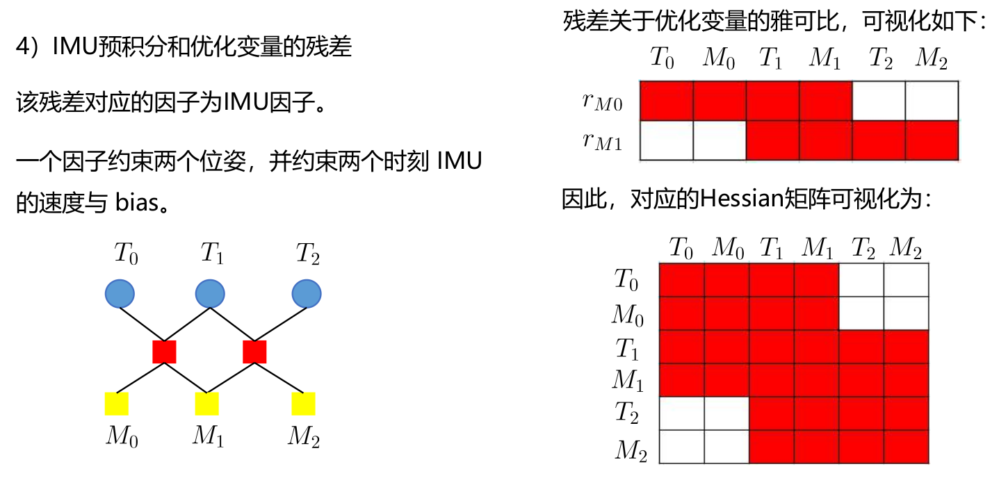

# Sensor Fusion: Sliding Window for Real-Time Lidar Localization -- 多传感器融合定位: 基于滑动窗口的实时定位

This is the solution of Assignment 07 of Sensor Fusion from [深蓝学院](https://www.shenlanxueyuan.com/course/261).

深蓝学院从多传感器融合定位第7节Sliding Window for Real-Time Localization答案. 版权归深蓝学院所有. 请勿抄袭.

---

## Problem Statement

---

## 1. 推导使用LOAM构建残差时, 与之相关联的两个位姿的Jacobian

### ANS

完整的推导过程参见[here](doc/derivation/01-loam-jacobians.pdf). 此处仅将结论摘录如下, 详细的符号定义参考推导文档.


---

## 2. 实现基于Sliding-Window的实时定位(Will be Available on 03/01/2021)

### ANS 

算法中的关键计算步骤的推导参考[here](doc/derivation/02-sliding-window-for-real-time-lidar-localization.pdf)

简化后的**sliding-window backend using Ceres**如下. 

#### Problem
```c++
    // init problem:
    ceres::Problem problem;

    // config solver:
    ceres::Solver::Options options;
    
    options.linear_solver_type = ceres::DENSE_SCHUR;
    //  options.num_threads = 8;
    options.trust_region_strategy_type = ceres::DOGLEG;
    //  options.trust_region_strategy_type = ceres::LEVENBERG_MARQUARDT;
    options.max_num_iterations = 10;
    //  options.use_explicit_schur_complement = true;
    //  options.minimizer_progress_to_stdout = true;
    //  options.use_nonmonotonic_steps = true;
    options.max_solver_time_in_seconds = 0.10;

    // a. LossFunction -- robust kernel function, Cauchy:
    ceres::LossFunction *loss_function = new ceres::CauchyLoss(1.0);
```

#### ParameterBlock
```c++
    // b. ParameterBlock -- PRVAG for each pose inside the sliding window
    //        there are N + 1 extended poses in total
    //            [p + 0, ..., p + N] 
    //        N is the sliding window size
    std::vector<double *> para_ids;
    
    for (int i = 0; i < estimator_config_.opt_window_size + 1; ++i) {
        ceres::LocalParameterization *local_parameterization = new PoseLocalParameterization();
        
        problem.AddParameterBlock(para_pose_[i], SIZE_POSE, local_parameterization);
        problem.AddParameterBlock(para_speed_bias_[i], SIZE_SPEED_BIAS);
        
        para_ids.push_back(para_pose_[i]);
        para_ids.push_back(para_speed_bias_[i]);
    }
```

#### ResidualBlock

##### Map Matching / GNSS Position


```c++
    // TO-BE-ADDED
    // c.1. ResidualBlock, map matching / GNSS position
    //        there are N + 1 map matching / GNSS position residuals in total
    //            [p + 0, ..., p + N] 
    //        N is the sliding window size
```

##### Relative Pose from Lidar Frontend


```c++
    // TO-BE-ADDED
    // c.2. ResidualBlock, relative pose from lidar frontend
    //        there are N relative pose residuals in total
    //            [(p + 0, p + 1), ..., (p + N - 1, p + N)]
    //        N is the sliding window size
```

##### IMU Pre-Integration



```c++
    // c.3. ResidualBlock, IMU pre-integration
    //        there are N IMU pre-integration residuals in total
    //            [(p + 0, p + 1), ..., (p + N - 1, p + N)]
    //        N is the sliding window size
    std::vector<ceres::internal::ResidualBlock *> res_ids_pim;
    
    if (estimator_config_.imu_factor) {
        for (int i = 0; i < estimator_config_.opt_window_size; ++i) {
            int j = i + 1;
            
            int opt_i = int(estimator_config_.window_size - estimator_config_.opt_window_size + i);
            int opt_j = opt_i + 1;
            
            if (pre_integrations_[opt_j]->sum_dt_ > 10.0) {
                continue;
            }

            ImuFactor *f = new ImuFactor(pre_integrations_[opt_j]);

            ceres::internal::ResidualBlock *res_id = problem.AddResidualBlock(
                f,
                NULL,
                para_pose_[i], para_speed_bias_[i],
                para_pose_[j], para_speed_bias_[j]
            );

            res_ids_pim.push_back(res_id);
        }
    }
```

#### Solve:


```c++
    TicToc t_opt;
    // solve:
    ceres::Solver::Summary summary;
    ceres::Solve(options, &problem, &summary);
    DLOG(INFO) << summary.BriefReport();

    // time it:
    ROS_DEBUG_STREAM("t_opt: " << t_opt.Toc() << " ms");
    DLOG(INFO) <<"t_opt: " << t_opt.Toc() << " ms";

    // residual monitor:
    {
        double cost = 0.0;
        ceres::Problem::EvaluateOptions e_option;

        // 1. map matching / GNSS position:
        if (estimator_config_.imu_factor) {
            e_option.parameter_blocks = para_ids;
            e_option.residual_blocks = res_ids_pim;
            problem.Evaluate(e_option, &cost, NULL, NULL, NULL);
            DLOG(INFO) << "aft_pim: " << cost;
        }

        // 2. relative pose from lidar frontend:
        if (estimator_config_.point_distance_factor) {
            e_option.parameter_blocks = para_ids;
            e_option.residual_blocks = res_ids_proj;
            problem.Evaluate(e_option, &cost, NULL, NULL, NULL);
            DLOG(INFO) << "aft_proj: " << cost;
        }

        // 3. IMU pre-integration
        if (estimator_config_.marginalization_factor) {
            if (last_marginalization_info && !res_ids_marg.empty()) {
                e_option.parameter_blocks = para_ids;
                e_option.residual_blocks = res_ids_marg;
                problem.Evaluate(e_option, &cost, NULL, NULL, NULL);
                DLOG(INFO) << "aft_marg: " << cost;
            }
        }

        // 4. marginalization:
        if (estimator_config_.marginalization_factor) {
            if (last_marginalization_info && !res_ids_marg.empty()) {
                e_option.parameter_blocks = para_ids;
                e_option.residual_blocks = res_ids_marg;
                problem.Evaluate(e_option, &cost, NULL, NULL, NULL);
                DLOG(INFO) << "aft_marg: " << cost;
            }
        }
    }
```
